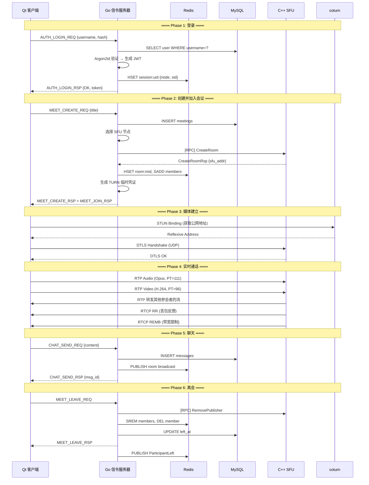

# 视频会议系统 — 接口定义文档 (Part 2: SFU + 客户端接口)

> 接续 Part 1，涵盖 SFU 内部 RPC、媒体接口、客户端 C++ 抽象接口

---

## 4. 信令服务器 ↔ SFU 内部 RPC

Go 信令服务器通过 **TCP + Protobuf** 与 C++ SFU 进行内部通信（非客户端可见）。

### 4.1 RPC 消息定义

```protobuf
// sfu_rpc.proto — 仅用于 Go ↔ C++ SFU 内部通信
syntax = "proto3";
package sfu_rpc;

// --- 房间管理 ---

message CreateRoomReq {
  string meeting_id      = 1;
  int32  max_publishers  = 2;
}
message CreateRoomRsp {
  bool   success         = 1;
  string sfu_address     = 2;   // "ip:port" 供客户端连接
}

message DestroyRoomReq {
  string meeting_id = 1;
}
message DestroyRoomRsp {
  bool success = 1;
}

// --- 参与者管理 ---

message AddPublisherReq {
  string meeting_id = 1;
  string user_id    = 2;
  uint32 audio_ssrc = 3;   // 分配的音频 SSRC
  uint32 video_ssrc = 4;   // 分配的视频 SSRC
}
message AddPublisherRsp {
  bool   success    = 1;
  uint32 udp_port   = 2;   // 分配给该Publisher的 UDP 端口
}

message RemovePublisherReq {
  string meeting_id = 1;
  string user_id    = 2;
}
message RemovePublisherRsp {
  bool success = 1;
}

// --- 质量反馈 (SFU → Signaling) ---

message QualityReport {
  string meeting_id    = 1;
  string user_id       = 2;
  float  packet_loss   = 3;  // 0.0 ~ 1.0
  uint32 rtt_ms        = 4;
  uint32 jitter_ms     = 5;
  uint32 bitrate_kbps  = 6;
}

// --- 请求关键帧 (SFU → Publisher，通过 Signaling 转发) ---

message KeyframeRequest {
  string meeting_id = 1;
  string user_id    = 2;   // 目标发布者
}
```

### 4.2 RPC 接口总表

| 方向 | 方法 | 请求 | 响应 | 说明 |
|------|------|------|------|------|
| Sig→SFU | `CreateRoom` | `CreateRoomReq` | `CreateRoomRsp` | 首人入会时创建 |
| Sig→SFU | `DestroyRoom` | `DestroyRoomReq` | `DestroyRoomRsp` | 最后一人离会时销毁 |
| Sig→SFU | `AddPublisher` | `AddPublisherReq` | `AddPublisherRsp` | 用户入会后注册 |
| Sig→SFU | `RemovePublisher` | `RemovePublisherReq` | `RemovePublisherRsp` | 用户离会后注销 |
| SFU→Sig | `QualityReport` | `QualityReport` | — | 每 5s 上报一次质量数据 |
| SFU→Sig | `KeyframeRequest` | `KeyframeRequest` | — | 需要客户端发关键帧 |

---

## 5. SFU 媒体服务器接口 (C++)

### 5.1 UDP 媒体数据接口

客户端与 SFU 之间通过 UDP 传输以下数据，**不经过信令服务器**：

| 数据类型 | 方向 | 格式 | 说明 |
|---------|------|------|------|
| RTP 音频 | Client→SFU | RFC 3550, PT=111 (Opus) | 20ms 帧 / 包 |
| RTP 视频 | Client→SFU | RFC 3550, PT=96 (H.264) | FU-A 分片 |
| RTP 转发 | SFU→Client | RFC 3550 (SSRC 重写) | 其他参会者的流 |
| RTCP SR | Client→SFU | RFC 3550 | 发送端统计 |
| RTCP RR | SFU→Client | RFC 3550 | 接收端丢包/抖动 |
| RTCP NACK | Client→SFU | RFC 4585 | 请求重传丢失包 |
| RTCP PLI | SFU→Client | RFC 4585 | 请求关键帧 |
| RTCP REMB | SFU→Client | draft-alvestrand | 带宽限制反馈 |

### 5.2 C++ SFU 核心接口

```cpp
// === 房间管理器 ===
class IRoomManager {
public:
    virtual ~IRoomManager() = default;
    virtual bool createRoom(const std::string& meetingId, int maxPublishers) = 0;
    virtual bool destroyRoom(const std::string& meetingId) = 0;
    virtual Room* getRoom(const std::string& meetingId) = 0;
};

// === 房间 ===
class IRoom {
public:
    virtual ~IRoom() = default;
    virtual bool addPublisher(const std::string& userId, uint32_t audioSSRC, uint32_t videoSSRC) = 0;
    virtual bool removePublisher(const std::string& userId) = 0;
    virtual void routeRTPPacket(const uint8_t* data, size_t len, const sockaddr_in& from) = 0;
    virtual void handleRTCP(const uint8_t* data, size_t len, const sockaddr_in& from) = 0;
    virtual std::vector<std::string> getPublisherIds() const = 0;
};

// === RTP 路由器 ===
class IRTPRouter {
public:
    virtual ~IRTPRouter() = default;

    // 根据 SSRC 查找 Publisher，转发给所有 Subscriber
    virtual void route(const uint8_t* rtpPacket, size_t len) = 0;

    // 注册 SSRC → Publisher 映射
    virtual void registerSSRC(uint32_t ssrc, const std::string& userId) = 0;
    virtual void unregisterSSRC(uint32_t ssrc) = 0;
};

// === NACK 重传缓冲区 ===
class INackBuffer {
public:
    virtual ~INackBuffer() = default;
    virtual void store(uint16_t seq, const uint8_t* data, size_t len) = 0;
    virtual bool retransmit(uint16_t seq, const sockaddr_in& to) = 0;
    // 环形缓冲，最近 500 包
};

// === 带宽估计器 ===
class IBandwidthEstimator {
public:
    virtual ~IBandwidthEstimator() = default;
    // 输入 RTCP RR，输出建议码率
    virtual uint32_t estimate(float packetLoss, uint32_t rttMs, uint32_t jitterMs) = 0;
    virtual uint32_t getRecommendedBitrateKbps() const = 0;
};
```

---

## 6. 客户端 C++ 抽象接口

### 6.1 网络层接口

```cpp
// === 信令客户端接口 ===
class ISignalingClient : public QObject {
    Q_OBJECT
public:
    virtual ~ISignalingClient() = default;

    // 连接/断开
    virtual void connectToServer(const QString& host, uint16_t port) = 0;
    virtual void disconnect() = 0;
    virtual bool isConnected() const = 0;

    // 认证
    virtual void login(const QString& username, const QString& passwordHash) = 0;
    virtual void logout() = 0;

    // 会议
    virtual void createMeeting(const QString& title, const QString& password) = 0;
    virtual void joinMeeting(const QString& meetingId, const QString& password) = 0;
    virtual void leaveMeeting() = 0;
    virtual void kickParticipant(const QString& userId) = 0;
    virtual void muteAll(bool mute) = 0;

    // 媒体协商 (透传)
    virtual void sendOffer(const QString& targetUserId, const QString& sdp) = 0;
    virtual void sendAnswer(const QString& targetUserId, const QString& sdp) = 0;
    virtual void sendIceCandidate(const QString& targetUserId,
                                  const QString& candidate,
                                  const QString& sdpMid, int sdpMlineIndex) = 0;
    virtual void sendMuteToggle(int mediaType, bool muted) = 0;

    // 聊天
    virtual void sendChatMessage(const QString& content, int type = 0) = 0;

signals:
    // 认证回调
    void loginResult(bool success, const QString& token, const QString& error);
    void kicked(const QString& reason);

    // 会议回调
    void meetingCreated(bool success, const QString& meetingId);
    void meetingJoined(bool success, const QString& sfuAddr,
                       const QList<ParticipantInfo>& participants);
    void participantJoined(const ParticipantInfo& info);
    void participantLeft(const QString& userId, const QString& reason);
    void hostChanged(const QString& newHostId);

    // 媒体协商回调
    void offerReceived(const QString& fromUserId, const QString& sdp);
    void answerReceived(const QString& fromUserId, const QString& sdp);
    void iceCandidateReceived(const QString& fromUserId,
                              const QString& candidate,
                              const QString& sdpMid, int sdpMlineIndex);
    void muteToggleReceived(const QString& userId, int mediaType, bool muted);

    // 聊天回调
    void chatMessageReceived(const ChatMessageInfo& msg);

    // 连接状态
    void connected();
    void disconnected();
    void reconnecting(int attempt);
    void networkQualityChanged(int level);
};
```

### 6.2 音视频引擎接口

```cpp
// === 视频采集接口 ===
class IVideoCapture {
public:
    virtual ~IVideoCapture() = default;
    virtual bool start(int width, int height, int fps) = 0;
    virtual void stop() = 0;
    virtual bool isRunning() const = 0;
    virtual QStringList availableDevices() const = 0;
    virtual void setDevice(const QString& deviceId) = 0;

    // 注册帧回调 (采集线程调用)
    using FrameCallback = std::function<void(AVFramePtr frame)>;
    virtual void setFrameCallback(FrameCallback cb) = 0;
};

// === 屏幕采集接口 ===
class IScreenCapture {
public:
    virtual ~IScreenCapture() = default;
    virtual bool start(int fps = 15) = 0;
    virtual void stop() = 0;
    virtual QList<ScreenInfo> availableScreens() const = 0;
    virtual QList<WindowInfo> availableWindows() const = 0;
    virtual void selectScreen(int screenIndex) = 0;
    virtual void selectWindow(uint64_t windowId) = 0;

    using FrameCallback = std::function<void(AVFramePtr frame)>;
    virtual void setFrameCallback(FrameCallback cb) = 0;
};

// === 编码器接口 ===
class IVideoEncoder {
public:
    virtual ~IVideoEncoder() = default;
    virtual bool init(const EncoderConfig& config) = 0;
    virtual void shutdown() = 0;
    virtual bool encode(const AVFrame* frame, std::vector<AVPacketPtr>& packets) = 0;
    virtual void requestKeyframe() = 0;
    virtual void setBitrate(int kbps) = 0;
    virtual QString codecName() const = 0;
    virtual bool isHardwareAccelerated() const = 0;
};

// === 解码器接口 ===
class IVideoDecoder {
public:
    virtual ~IVideoDecoder() = default;
    virtual bool init(AVCodecID codecId, bool preferHardware = true) = 0;
    virtual void shutdown() = 0;
    virtual bool decode(const AVPacket* packet, std::vector<AVFramePtr>& frames) = 0;
    virtual bool isHardwareAccelerated() const = 0;
};

// === 音频采集接口 ===
class IAudioCapture {
public:
    virtual ~IAudioCapture() = default;
    virtual bool start(int sampleRate, int channels) = 0;
    virtual void stop() = 0;
    virtual QStringList availableDevices() const = 0;
    virtual void setDevice(const QString& deviceId) = 0;

    // 回调：每 20ms 一帧 PCM 数据
    using AudioCallback = std::function<void(const float* data, int samples)>;
    virtual void setCallback(AudioCallback cb) = 0;
};

// === 音频编解码接口 ===
class IAudioCodec {
public:
    virtual ~IAudioCodec() = default;
    virtual bool initEncoder(int sampleRate, int channels, int bitrateKbps) = 0;
    virtual bool initDecoder(int sampleRate, int channels) = 0;
    virtual bool encode(const float* pcm, int samples, std::vector<uint8_t>& output) = 0;
    virtual bool decode(const uint8_t* data, int len, std::vector<float>& output) = 0;
};

// === 视频渲染接口 ===
class IVideoRenderer {
public:
    virtual ~IVideoRenderer() = default;
    // 接收解码后的帧（NV12 格式），上传 GPU 纹理
    virtual void renderFrame(const AVFrame* frame) = 0;
    virtual void setViewport(int x, int y, int w, int h) = 0;
};

// === RTP 传输接口 ===
class IRTPTransport {
public:
    virtual ~IRTPTransport() = default;
    virtual bool bind(const QString& sfuAddr, uint16_t port) = 0;
    virtual void close() = 0;
    virtual bool sendRTP(const uint8_t* data, size_t len) = 0;
    virtual bool sendRTCP(const uint8_t* data, size_t len) = 0;

    using RTPCallback = std::function<void(const uint8_t* data, size_t len)>;
    virtual void setRTPCallback(RTPCallback cb) = 0;

    using RTCPCallback = std::function<void(const uint8_t* data, size_t len)>;
    virtual void setRTCPCallback(RTCPCallback cb) = 0;
};
```

### 6.3 存储层接口

```cpp
// === 本地数据库接口 (SQLite) ===
class ILocalStorage {
public:
    virtual ~ILocalStorage() = default;

    // 用户
    virtual bool saveUserProfile(const UserProfile& profile) = 0;
    virtual std::optional<UserProfile> getUserProfile() = 0;
    virtual bool saveToken(const QString& token) = 0;
    virtual QString getToken() = 0;

    // 消息
    virtual bool saveMessage(const ChatMessage& msg) = 0;
    virtual QVector<ChatMessage> getMessages(const QString& meetingId,
                                              int offset, int limit) = 0;
    virtual QVector<ChatMessage> searchMessages(const QString& keyword) = 0;

    // 通话记录
    virtual bool saveCallLog(const CallLog& log) = 0;
    virtual QVector<CallLog> getCallLogs(int offset, int limit) = 0;

    // 设置
    virtual bool saveSetting(const QString& key, const QString& value) = 0;
    virtual QString getSetting(const QString& key, const QString& defaultVal = "") = 0;
};
```

---

## 7. 完整时序图：入会 → 通话 → 离会


