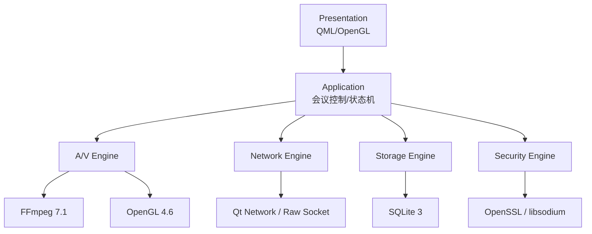
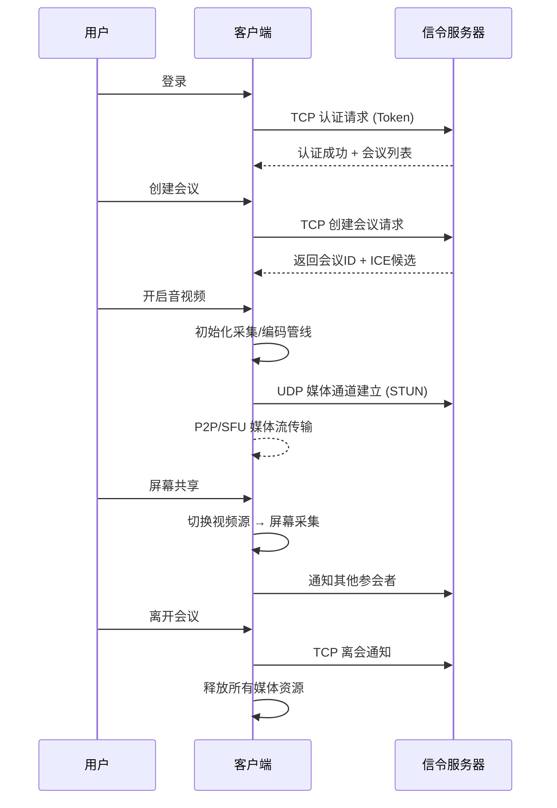
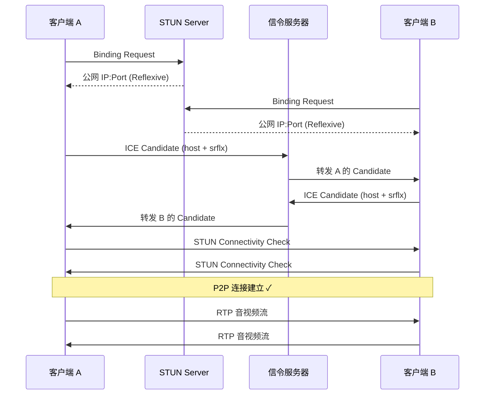
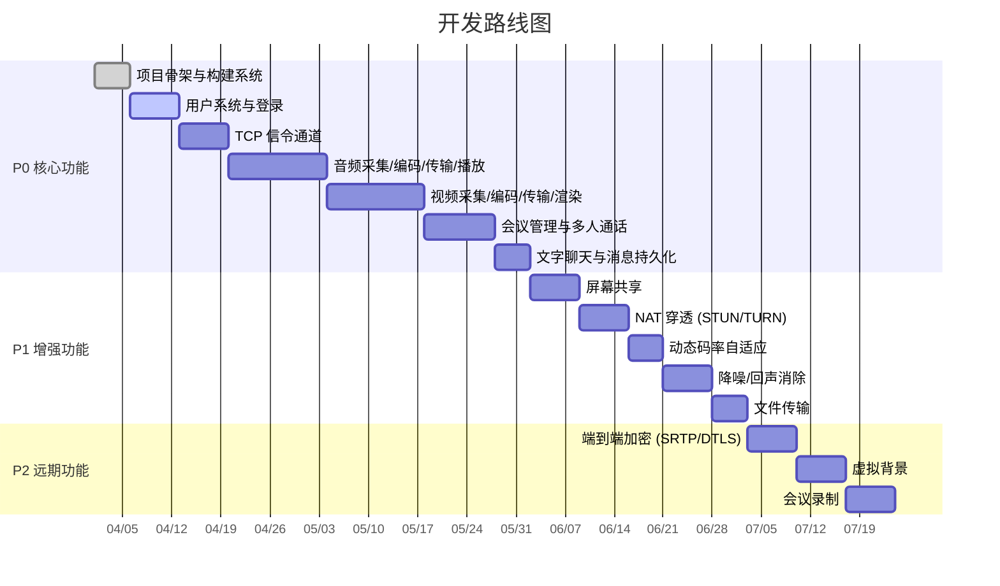

# 跨平台视频会议/远程协作客户端 — 需求设计文档

> **技术栈**：Qt 6.9 (Qt Quick/QML) · FFmpeg 7.1 · SQLite 3 · OpenGL 4.6 Core Profile · C++17
> **目标平台**：Windows / macOS / Linux

---

## 1. 项目概述

### 1.1 产品定位

一款面向中小团队的**轻量级跨平台视频会议客户端**，提供实时音视频通话、屏幕共享、文字聊天、文件传输等远程协作能力。强调低延迟、高画质、端到端加密，同时保持客户端体积小巧、资源占用低。

### 1.2 核心目标

| 目标 | 指标 |
|------|------|
| 端到端音视频延迟 | ≤ 200ms（局域网 ≤ 50ms） |
| 视频分辨率 | 最高 1080p@30fps，支持动态降级 |
| 并发参会人数 | P2P 模式 ≤ 4 人，SFU 模式 ≤ 16 人 |
| 客户端 CPU 占用 | 开启硬件加速时 ≤ 15% |
| 本地存储 | SQLite 支持 10 万条消息无感查询 |
| 冷启动时间 | ≤ 2 秒 |

---

## 2. 分层架构设计

### 2.1 总体架构图

```
┌─────────────────────────────────────────────────────────┐
│                    Presentation Layer                    │
│              (QML UI Components / OpenGL)                │
├─────────────────────────────────────────────────────────┤
│                    Application Layer                     │
│     (会议控制 / 用户管理 / 消息路由 / 状态机)              │
├─────────────────────────────────────────────────────────┤
│                     Service Layer                        │
│  ┌──────────┐ ┌──────────┐ ┌──────────┐ ┌────────────┐ │
│  │ A/V      │ │ Network  │ │ Storage  │ │ Security   │ │
│  │ Engine   │ │ Engine   │ │ Engine   │ │ Engine     │ │
│  └──────────┘ └──────────┘ └──────────┘ └────────────┘ │
├─────────────────────────────────────────────────────────┤
│                    Platform Layer                        │
│  (FFmpeg / OpenGL / OS Audio API / Socket Abstraction)   │
└─────────────────────────────────────────────────────────┘
```

### 2.2 模块依赖关系



### 2.3 关键设计原则

| 原则 | 落地方式 |
|------|---------|
| **依赖倒置** | 所有 Engine 对外暴露纯虚接口（`IAudioCapture`, `IVideoEncoder` 等），上层通过接口编程 |
| **RAII 内存管理** | FFmpeg 结构体一律使用 `std::unique_ptr` + 自定义 Deleter |
| **事件驱动** | 模块间通信使用 Qt 信号槽（跨线程 `Qt::QueuedConnection`）或自定义事件总线 |
| **插件化扩展** | 编解码器、美颜滤镜等通过插件系统加载，不硬编码到主流程 |
| **零拷贝渲染** | 硬件解码 NV12 直接上传 GPU 纹理，Shader 转 RGB |

---

## 3. 功能模块设计

### 3.1 功能清单

#### P0 — MVP 核心功能

| 模块 | 功能 | 说明 |
|------|------|------|
| 用户系统 | 注册/登录 | 账号密码 + Token 鉴权 |
| 用户系统 | 个人资料 | 头像、昵称、状态 |
| 会议管理 | 创建/加入会议 | 会议号 + 密码机制 |
| 会议管理 | 会议大厅 | 显示进行中的会议列表 |
| 音频通话 | 麦克风采集 | PCM 采集 → Opus 编码 |
| 音频通话 | 音频播放 | Opus 解码 → PCM 播放 |
| 音频通话 | 回声消除 (AEC) | 基于 WebRTC AEC 模块或 SpeexDSP |
| 视频通话 | 摄像头采集 | 支持多摄像头切换 |
| 视频通话 | 视频编码 | H.264 硬件编码（NVENC/VideoToolbox/VAAPI） |
| 视频通话 | 视频解码渲染 | 硬件解码 + OpenGL Shader 渲染 |
| 文字聊天 | 会议内聊天 | 支持文字、表情、@某人 |
| 文字聊天 | 消息持久化 | SQLite 本地存储 |

#### P1 — 增强功能

| 模块 | 功能 | 说明 |
|------|------|------|
| 屏幕共享 | 全屏/窗口捕获 | 平台原生 API 采集 + H.264 编码 |
| 文件传输 | 会议内文件发送 | TCP 可靠传输，支持断点续传 |
| 会议录制 | 本地录制 | 多路音视频混合 Mux 为 MP4 |
| 音频处理 | 噪声抑制 (NS) | RNNoise 或 WebRTC NS |
| 音频处理 | 自动增益 (AGC) | 音量标准化 |
| 视频处理 | 虚拟背景 | GPU Shader 实现色度键/AI 分割 |
| 网络自适应 | 动态码率 | 基于 RTCP 丢包反馈，自适应调整分辨率/帧率/码率 |

#### P2 — 远期功能

| 模块 | 功能 |
|------|------|
| 白板协作 | 多人实时白板（矢量绘图 + 同步） |
| 会议转录 | 语音转文字（Whisper 集成） |
| 端到端加密 | SRTP + DTLS |

### 3.2 用户流程



---

## 4. 数据库设计 (SQLite 3)

### 4.1 设计原则

- **WAL 模式**：启用 `PRAGMA journal_mode=WAL` 支持读写并发
- **外键约束**：启用 `PRAGMA foreign_keys=ON`
- **索引策略**：高频查询字段建索引，避免全表扫描
- **时间戳**：统一使用 UTC 毫秒级 Unix 时间戳 (`INTEGER`)

### 4.2 ER 关系图

```mermaid
erDiagram
    USER ||--o{ MESSAGE : sends
    USER ||--o{ MEETING_PARTICIPANT : joins
    MEETING ||--o{ MEETING_PARTICIPANT : has
    MEETING ||--o{ MESSAGE : contains
    USER ||--o{ CONTACT : has
    MESSAGE ||--o{ FILE_TRANSFER : attaches

    USER {
        TEXT user_id PK
        TEXT username
        TEXT display_name
        TEXT avatar_path
        TEXT password_hash
        TEXT auth_token
        INTEGER status
        INTEGER created_at
        INTEGER last_login_at
    }

    MEETING {
        TEXT meeting_id PK
        TEXT title
        TEXT host_user_id FK
        TEXT password_hash
        INTEGER type
        INTEGER status
        INTEGER max_participants
        INTEGER created_at
        INTEGER ended_at
    }

    MEETING_PARTICIPANT {
        INTEGER id PK
        TEXT meeting_id FK
        TEXT user_id FK
        INTEGER role
        INTEGER join_at
        INTEGER leave_at
        INTEGER is_audio_on
        INTEGER is_video_on
        INTEGER is_screen_sharing
    }

    MESSAGE {
        INTEGER id PK
        TEXT meeting_id FK
        TEXT sender_id FK
        INTEGER type
        TEXT content
        TEXT reply_to_id
        INTEGER status
        INTEGER created_at
    }

    CONTACT {
        INTEGER id PK
        TEXT user_id FK
        TEXT contact_user_id FK
        TEXT remark_name
        INTEGER group_id
        INTEGER created_at
    }

    FILE_TRANSFER {
        INTEGER id PK
        TEXT meeting_id FK
        TEXT sender_id FK
        TEXT file_name
        TEXT file_path
        INTEGER file_size
        TEXT file_hash
        INTEGER status
        INTEGER progress
        INTEGER created_at
    }

    SETTINGS {
        TEXT key PK
        TEXT value
        TEXT category
        INTEGER updated_at
    }

    CALL_LOG {
        INTEGER id PK
        TEXT meeting_id FK
        TEXT caller_id FK
        INTEGER duration_ms
        INTEGER type
        INTEGER quality_score
        INTEGER started_at
        INTEGER ended_at
    }
```



### 4.3 建表 SQL

```sql
-- ==================== 用户表 ====================
CREATE TABLE IF NOT EXISTS user (
    user_id       TEXT PRIMARY KEY,                    -- UUID
    username      TEXT NOT NULL UNIQUE,
    display_name  TEXT NOT NULL DEFAULT '',
    avatar_path   TEXT DEFAULT '',
    password_hash TEXT NOT NULL,                       -- bcrypt/argon2 哈希
    auth_token    TEXT DEFAULT '',
    status        INTEGER NOT NULL DEFAULT 0,          -- 0=离线 1=在线 2=忙碌 3=免打扰
    created_at    INTEGER NOT NULL,
    last_login_at INTEGER NOT NULL DEFAULT 0
);
CREATE INDEX idx_user_username ON user(username);
CREATE INDEX idx_user_status ON user(status);

-- ==================== 会议表 ====================
CREATE TABLE IF NOT EXISTS meeting (
    meeting_id       TEXT PRIMARY KEY,                 -- 6-8位数字会议号
    title            TEXT NOT NULL DEFAULT '未命名会议',
    host_user_id     TEXT NOT NULL REFERENCES user(user_id),
    password_hash    TEXT DEFAULT '',                  -- 可选的会议密码
    type             INTEGER NOT NULL DEFAULT 0,       -- 0=即时会议 1=预约会议
    status           INTEGER NOT NULL DEFAULT 0,       -- 0=等待中 1=进行中 2=已结束
    max_participants INTEGER NOT NULL DEFAULT 16,
    created_at       INTEGER NOT NULL,
    ended_at         INTEGER DEFAULT 0
);
CREATE INDEX idx_meeting_host ON meeting(host_user_id);
CREATE INDEX idx_meeting_status ON meeting(status);

-- ==================== 参会者表 ====================
CREATE TABLE IF NOT EXISTS meeting_participant (
    id                INTEGER PRIMARY KEY AUTOINCREMENT,
    meeting_id        TEXT NOT NULL REFERENCES meeting(meeting_id),
    user_id           TEXT NOT NULL REFERENCES user(user_id),
    role              INTEGER NOT NULL DEFAULT 0,      -- 0=参会者 1=主持人 2=联合主持人
    join_at           INTEGER NOT NULL,
    leave_at          INTEGER DEFAULT 0,
    is_audio_on       INTEGER NOT NULL DEFAULT 0,
    is_video_on       INTEGER NOT NULL DEFAULT 0,
    is_screen_sharing INTEGER NOT NULL DEFAULT 0,
    UNIQUE(meeting_id, user_id)                        -- 同一用户同一会议只有一条记录
);
CREATE INDEX idx_mp_meeting ON meeting_participant(meeting_id);

-- ==================== 消息表 ====================
CREATE TABLE IF NOT EXISTS message (
    id          INTEGER PRIMARY KEY AUTOINCREMENT,
    meeting_id  TEXT NOT NULL REFERENCES meeting(meeting_id),
    sender_id   TEXT NOT NULL REFERENCES user(user_id),
    type        INTEGER NOT NULL DEFAULT 0,            -- 0=文字 1=图片 2=文件 3=系统通知
    content     TEXT NOT NULL,
    reply_to_id TEXT DEFAULT NULL,                     -- 引用回复的消息ID
    status      INTEGER NOT NULL DEFAULT 0,            -- 0=发送中 1=已发送 2=已读
    created_at  INTEGER NOT NULL
);
CREATE INDEX idx_msg_meeting_time ON message(meeting_id, created_at DESC);
CREATE INDEX idx_msg_sender ON message(sender_id);
-- 全文搜索索引（FTS5）
CREATE VIRTUAL TABLE IF NOT EXISTS message_fts USING fts5(
    content,
    content='message',
    content_rowid='id'
);

-- ==================== 联系人表 ====================
CREATE TABLE IF NOT EXISTS contact (
    id              INTEGER PRIMARY KEY AUTOINCREMENT,
    user_id         TEXT NOT NULL REFERENCES user(user_id),
    contact_user_id TEXT NOT NULL REFERENCES user(user_id),
    remark_name     TEXT DEFAULT '',
    group_id        INTEGER DEFAULT 0,                 -- 分组ID
    created_at      INTEGER NOT NULL,
    UNIQUE(user_id, contact_user_id)
);
CREATE INDEX idx_contact_user ON contact(user_id);

-- ==================== 文件传输表 ====================
CREATE TABLE IF NOT EXISTS file_transfer (
    id         INTEGER PRIMARY KEY AUTOINCREMENT,
    meeting_id TEXT NOT NULL REFERENCES meeting(meeting_id),
    sender_id  TEXT NOT NULL REFERENCES user(user_id),
    file_name  TEXT NOT NULL,
    file_path  TEXT NOT NULL,                          -- 本地存储路径
    file_size  INTEGER NOT NULL,                       -- 字节
    file_hash  TEXT NOT NULL DEFAULT '',               -- SHA-256 校验
    status     INTEGER NOT NULL DEFAULT 0,             -- 0=等待 1=传输中 2=完成 3=失败
    progress   INTEGER NOT NULL DEFAULT 0,             -- 0-100
    created_at INTEGER NOT NULL
);
CREATE INDEX idx_ft_meeting ON file_transfer(meeting_id);

-- ==================== 通话记录表 ====================
CREATE TABLE IF NOT EXISTS call_log (
    id            INTEGER PRIMARY KEY AUTOINCREMENT,
    meeting_id    TEXT NOT NULL REFERENCES meeting(meeting_id),
    caller_id     TEXT NOT NULL REFERENCES user(user_id),
    duration_ms   INTEGER NOT NULL DEFAULT 0,
    type          INTEGER NOT NULL DEFAULT 0,          -- 0=音频通话 1=视频通话 2=屏幕共享
    quality_score INTEGER DEFAULT 0,                   -- 0-100 通话质量评分
    started_at    INTEGER NOT NULL,
    ended_at      INTEGER DEFAULT 0
);
CREATE INDEX idx_cl_caller ON call_log(caller_id, started_at DESC);

-- ==================== 设置表 ====================
CREATE TABLE IF NOT EXISTS settings (
    key        TEXT PRIMARY KEY,                       -- 如 'audio.input_device', 'video.resolution'
    value      TEXT NOT NULL DEFAULT '',
    category   TEXT NOT NULL DEFAULT 'general',        -- general/audio/video/network/ui
    updated_at INTEGER NOT NULL
);
CREATE INDEX idx_settings_cat ON settings(category);
```

---

## 5. 网络协议设计

### 5.1 双通道架构

```
┌──────────────────────────────────────────────────┐
│                  Network Engine                   │
│                                                   │
│  ┌─────────────────┐    ┌──────────────────────┐ │
│  │ Signaling Channel│    │  Media Channel       │ │
│  │   (TCP/TLS)      │    │  (UDP/DTLS)          │ │
│  │                  │    │                      │ │
│  │ • 登录/认证       │    │ • RTP 音视频包        │ │
│  │ • 会议控制        │    │ • RTCP 质量反馈       │ │
│  │ • 成员状态同步    │    │ • STUN/TURN NAT穿透  │ │
│  │ • 文字聊天        │    │ • 带宽探测 (BWE)      │ │
│  │ • 心跳保活        │    │                      │ │
│  └─────────────────┘    └──────────────────────┘ │
└──────────────────────────────────────────────────┘
```

### 5.2 信令协议（TCP 通道）

#### 报文格式（二进制帧）

```
┌──────────┬──────────┬──────────┬───────────┬──────────┐
│  Magic   │ Version  │  Type    │  Length   │ Payload  │
│  2 bytes │ 1 byte   │ 2 bytes  │  4 bytes  │ N bytes  │
├──────────┼──────────┼──────────┼───────────┼──────────┤
│  0xAB CD │  0x01    │  见下表   │ 大端序     │ Protobuf │
└──────────┴──────────┴──────────┴───────────┴──────────┘
```

#### 消息类型定义

```cpp
enum class SignalType : uint16_t {
    // === 认证 (0x01xx) ===
    AUTH_LOGIN_REQ       = 0x0101,
    AUTH_LOGIN_RSP       = 0x0102,
    AUTH_LOGOUT_REQ      = 0x0103,
    AUTH_LOGOUT_RSP      = 0x0104,
    AUTH_HEARTBEAT       = 0x0105,     // 30秒间隔心跳

    // === 会议控制 (0x02xx) ===
    MEET_CREATE_REQ      = 0x0201,
    MEET_CREATE_RSP      = 0x0202,
    MEET_JOIN_REQ        = 0x0203,
    MEET_JOIN_RSP        = 0x0204,
    MEET_LEAVE_REQ       = 0x0205,
    MEET_LEAVE_RSP       = 0x0206,
    MEET_KICK_REQ        = 0x0207,     // 踢人
    MEET_MUTE_REQ        = 0x0208,     // 全员静音
    MEET_STATE_SYNC      = 0x0209,     // 全量状态同步

    // === 媒体协商 (0x03xx) ===
    MEDIA_OFFER          = 0x0301,     // SDP Offer（编码能力交换）
    MEDIA_ANSWER         = 0x0302,     // SDP Answer
    MEDIA_ICE_CANDIDATE  = 0x0303,     // ICE 候选地址
    MEDIA_MUTE_TOGGLE    = 0x0304,     // 开关摄像头/麦克风通知

    // === 聊天 (0x04xx) ===
    CHAT_SEND_REQ        = 0x0401,
    CHAT_SEND_RSP        = 0x0402,
    CHAT_RECV_NOTIFY     = 0x0403,

    // === 文件 (0x05xx) ===
    FILE_OFFER_REQ       = 0x0501,
    FILE_OFFER_RSP       = 0x0502,
    FILE_CHUNK           = 0x0503,
    FILE_COMPLETE        = 0x0504,
};
```

#### 心跳与重连策略

```
心跳间隔: 30s
超时判断: 连续 3 次 (90s) 无心跳响应 → 断开连接
重连策略: 指数退避 → 1s, 2s, 4s, 8s, 16s, 最大 30s
重连时携带: auth_token → 服务端恢复会话状态，无需重新登录
```

### 5.3 媒体协议（UDP 通道）

#### RTP 头部（RFC 3550 标准）

```
 0                   1                   2                   3
 0 1 2 3 4 5 6 7 8 9 0 1 2 3 4 5 6 7 8 9 0 1 2 3 4 5 6 7 8 9 0 1
+-+-+-+-+-+-+-+-+-+-+-+-+-+-+-+-+-+-+-+-+-+-+-+-+-+-+-+-+-+-+-+-+
|V=2|P|X|  CC   |M|     PT      |       Sequence Number         |
+-+-+-+-+-+-+-+-+-+-+-+-+-+-+-+-+-+-+-+-+-+-+-+-+-+-+-+-+-+-+-+-+
|                           Timestamp                           |
+-+-+-+-+-+-+-+-+-+-+-+-+-+-+-+-+-+-+-+-+-+-+-+-+-+-+-+-+-+-+-+-+
|                             SSRC                              |
+-+-+-+-+-+-+-+-+-+-+-+-+-+-+-+-+-+-+-+-+-+-+-+-+-+-+-+-+-+-+-+-+
```

#### Payload Type 分配

| PT | 编码 | 采样率 | 用途 |
|----|------|--------|------|
| 111 | Opus | 48kHz | 音频 |
| 96 | H.264 | 90kHz | 视频（摄像头） |
| 97 | H.264 | 90kHz | 视频（屏幕共享） |

#### NAT 穿透流程



> **降级策略**：P2P 失败 → TURN 中继，TURN 失败 → TCP 隧道

#### 动态码率自适应（BWE）

```
RTCP Receiver Report:
  ├── 丢包率 > 5%  → 降低码率 30%，降低帧率到 15fps
  ├── 丢包率 > 15% → 降低分辨率到 360p，码率 300kbps
  ├── 丢包率 > 30% → 关闭视频，仅保留音频
  └── 丢包率 < 2%  → 逐步恢复码率（每 5s 增加 10%）

RTT 阈值:
  ├── RTT > 300ms → 增大 jitter buffer 到 100ms
  └── RTT > 500ms → 切换 TURN 中继
```

---

## 6. 音视频管线设计 (FFmpeg 7.1)

### 6.1 总体管线

```
┌─────────────────── 发送端管线 ───────────────────┐
│                                                    │
│  ┌─────────┐   ┌──────────┐   ┌──────────┐       │
│  │ Capture  │→→│ PreProc  │→→│ Encode   │→→ RTP │
│  │ 采集     │   │ 前处理    │   │ 编码     │       │
│  └─────────┘   └──────────┘   └──────────┘       │
│  摄像头/麦克   降噪/AEC/AGC    H.264/Opus         │
│  风/屏幕       美颜/缩放                           │
└────────────────────────────────────────────────────┘

┌─────────────────── 接收端管线 ───────────────────┐
│                                                    │
│       ┌──────────┐   ┌──────────┐   ┌─────────┐  │
│  RTP→→│ Decode   │→→│ PostProc │→→│ Render  │  │
│       │ 解码     │   │ 后处理    │   │ 渲染    │  │
│       └──────────┘   └──────────┘   └─────────┘  │
│       H.264/Opus     音量/混音       OpenGL/音频设备│
└────────────────────────────────────────────────────┘
```

### 6.2 视频采集与编码

```cpp
// === 核心数据结构：RAII Wrappers ===

// FFmpeg 结构体的 RAII 封装（铁律：禁止裸指针）
using AVFramePtr = std::unique_ptr<AVFrame, decltype([](AVFrame* f) {
    av_frame_free(&f);
})>;

using AVPacketPtr = std::unique_ptr<AVPacket, decltype([](AVPacket* p) {
    av_packet_free(&p);
})>;

using AVCodecCtxPtr = std::unique_ptr<AVCodecContext, decltype([](AVCodecContext* c) {
    avcodec_free_context(&c);
})>;

using AVHWDeviceCtxPtr = std::unique_ptr<AVBufferRef, decltype([](AVBufferRef* b) {
    av_buffer_unref(&b);
})>;
```

#### 硬件编码器初始化流程

```cpp
// 编码器优先级探测链:
//   Windows: h264_nvenc → h264_amf → h264_qsv → libx264(fallback)
//   macOS:   h264_videotoolbox → libx264(fallback)
//   Linux:   h264_vaapi → h264_nvenc → libx264(fallback)

struct EncoderConfig {
    int width          = 1280;
    int height         = 720;
    int fps            = 30;
    int bitrate_kbps   = 2000;
    int gop_size       = 60;      // 关键帧间隔 = 2秒（便于随机接入）
    int max_b_frames   = 0;       // 实时通信禁用 B 帧（降低延迟）
    std::string preset = "ultrafast";  // 最低编码延迟
    std::string tune   = "zerolatency";
};
```

### 6.3 音频采集与编码

```
┌──────────────────────────────────────────────────┐
│               Audio Pipeline                      │
│                                                   │
│  Mic → [48kHz/f32/Mono] → AEC → NS → AGC        │
│           │                                       │
│           ↓                                       │
│       Opus Encoder (20ms 帧)                      │
│       bitrate: 32kbps (语音) / 64kbps (音乐)      │
│           │                                       │
│           ↓                                       │
│       RTP Packetizer                              │
│       (每个 Opus 帧 = 1 个 RTP 包)                │
└──────────────────────────────────────────────────┘
```

#### 音频参数规格

| 参数 | 值 | 说明 |
|------|-----|------|
| 采样率 | 48000 Hz | Opus 最佳采样率 |
| 采样格式 | `AV_SAMPLE_FMT_FLT` | 32-bit 浮点 |
| 声道布局 | Mono (通话) / Stereo (屏幕共享) | 使用 `AVChannelLayout` |
| 帧长 | 20ms (960 samples@48kHz) | 延迟与质量的平衡点 |
| Opus 码率 | 32kbps (VOIP) / 64kbps (Audio) | 自适应 |

### 6.4 视频渲染（OpenGL 4.6 Core Profile）

#### NV12 双平面纹理渲染 Shader

```glsl
// vertex shader
#version 460 core
layout(location = 0) in vec2 aPos;
layout(location = 1) in vec2 aTexCoord;
out vec2 vTexCoord;

void main() {
    gl_Position = vec4(aPos, 0.0, 1.0);
    vTexCoord = aTexCoord;
}
```

```glsl
// fragment shader
#version 460 core
in vec2 vTexCoord;
out vec4 fragColor;

uniform sampler2D texY;    // GL_RED   — Y 平面
uniform sampler2D texUV;   // GL_RG    — UV 交错平面

void main() {
    // 从 NV12 纹理读取 YUV 分量
    float y  = texture(texY,  vTexCoord).r;
    vec2  uv = texture(texUV, vTexCoord).rg;

    // BT.709 YUV → RGB 转换矩阵（高清视频标准）
    float u = uv.x - 0.5;
    float v = uv.y - 0.5;

    float r = y + 1.5748 * v;
    float g = y - 0.1873 * u - 0.4681 * v;
    float b = y + 1.8556 * u;

    fragColor = vec4(clamp(r, 0.0, 1.0),
                     clamp(g, 0.0, 1.0),
                     clamp(b, 0.0, 1.0), 1.0);
}
```

#### 多路视频宫格布局计算

```cpp
// 根据参会人数计算宫格布局
// 1人=全屏, 2人=1×2, 3-4人=2×2, 5-6人=2×3, 7-9人=3×3, 10-16人=4×4
struct GridLayout {
    int cols;
    int rows;
};

constexpr GridLayout calcGrid(int participantCount) {
    if (participantCount <= 1) return {1, 1};
    if (participantCount <= 2) return {2, 1};
    if (participantCount <= 4) return {2, 2};
    if (participantCount <= 6) return {3, 2};
    if (participantCount <= 9) return {3, 3};
    return {4, 4};
}
```

### 6.5 音视频同步策略

```
┌─────────────────────────────────────────────────────┐
│                A/V Sync (Pull-Model)                │
│                                                      │
│  Audio Device Callback (物理消耗驱动)                 │
│       │                                              │
│       ├── 记录当前 audio_pts（主时钟）                 │
│       │                                              │
│       ↓                                              │
│  Video Render Timer (16ms / 60Hz)                    │
│       │                                              │
│       ├── 读取 audio_pts                              │
│       ├── 从 decoded_frame_queue 中查找               │
│       │   最接近 audio_pts 的视频帧                    │
│       ├── video_pts < audio_pts - 40ms → 丢帧         │
│       ├── video_pts > audio_pts + 40ms → 等待         │
│       └── 渲染当前帧                                  │
│                                                      │
│  容忍窗口: ±40ms（人眼感知阈值）                       │
└─────────────────────────────────────────────────────┘
```

---

## 7. 线程模型

### 7.1 线程架构图

```
┌────────────────────────────────────────────────────────┐
│                    Thread Architecture                  │
│                                                         │
│  Main Thread (Qt GUI)                                   │
│  ├── QML 渲染、用户交互、信号槽路由                       │
│  ├── 绝对禁止：FFmpeg 解码、文件IO、重计算               │
│  │                                                      │
│  ├── Network I/O Thread                                 │
│  │   ├── TCP 信令收发（事件循环）                         │
│  │   └── UDP RTP/RTCP 收发                              │
│  │                                                      │
│  ├── Audio Capture Thread                               │
│  │   └── 麦克风 PCM 采集 → Ring Buffer                   │
│  │                                                      │
│  ├── Audio Encode Thread                                │
│  │   └── Ring Buffer → AEC/NS → Opus 编码 → RTP 发送    │
│  │                                                      │
│  ├── Audio Decode Thread                                │
│  │   └── RTP 接收 → Opus 解码 → Jitter Buffer → 播放    │
│  │                                                      │
│  ├── Video Capture Thread                               │
│  │   └── 摄像头/屏幕帧采集 → Frame Queue                 │
│  │                                                      │
│  ├── Video Encode Thread                                │
│  │   └── Frame Queue → 预处理 → H.264 编码 → RTP 发送   │
│  │                                                      │
│  ├── Video Decode Thread (per remote user)              │
│  │   └── RTP 接收 → H.264 解码 → Decoded Frame Queue    │
│  │                                                      │
│  ├── Render Thread (Qt Scene Graph)                     │
│  │   └── Decoded Frame → OpenGL 纹理上传 → 宫格渲染      │
│  │                                                      │
│  └── Database Thread                                    │
│      └── 所有 SQLite 读写操作（单线程串行化）              │
└────────────────────────────────────────────────────────┘
```

### 7.2 线程间通信机制

| 通信场景 | 机制 | 说明 |
|---------|------|------|
| 采集→编码 | 无锁 Ring Buffer | `std::atomic` 读写指针，零拷贝 |
| 解码→渲染 | `QMutex` + Frame Queue | 容量限制 = 3 帧（避免内存膨胀） |
| 网络→解码 | Jitter Buffer | 自适应深度（20ms ~ 200ms） |
| 任意→GUI | `Qt::QueuedConnection` | 信号槽跨线程安全投递 |
| 编码线程←→控制 | `QWaitCondition` | 停机时必须 `wakeAll()` 防死锁 |

### 7.3 防死锁规范

```cpp
// ❌ 危险模式：停机时 wait 永远不会被唤醒
void EncoderThread::run() {
    while (m_running) {
        QMutexLocker lock(&m_mutex);
        while (m_frameQueue.empty()) {
            m_condition.wait(&m_mutex);   // 停机后无人唤醒 → 死锁！
        }
    }
}

// ✅ 安全模式：wait 前检查运行状态
void EncoderThread::run() {
    while (m_running.load(std::memory_order_acquire)) {
        QMutexLocker lock(&m_mutex);
        while (m_frameQueue.empty() && m_running.load()) {
            m_condition.wait(&m_mutex, 100);  // 超时保护 100ms
        }
        if (!m_running.load()) break;         // 二次检查
        // ... 编码逻辑
    }
}

void EncoderThread::stop() {
    m_running.store(false, std::memory_order_release);
    m_condition.wakeAll();  // 确保唤醒正在 wait 的线程
    wait();                 // QThread::wait() 等待线程退出
}
```

---

## 8. Qt Quick UI 组件设计

### 8.1 组件树结构

```
Main.qml
├── TitleBar.qml                  // 自定义标题栏（拖拽/最小化/最大化/关闭）
├── SplitView (H)
│   ├── SidePanel.qml             // 侧边导航栏
│   │   ├── ContactList.qml       // 联系人列表
│   │   ├── MeetingList.qml       // 会议列表
│   │   └── ChatHistory.qml       // 历史聊天记录
│   └── MainContent.qml           // 主内容区
│       ├── HomePage.qml          // 首页（快速入会/创建会议）
│       ├── MeetingRoom.qml       // 会议房间
│       │   ├── VideoGrid.qml     // 视频宫格
│       │   │   └── VideoTile.qml // 单个视频块（OpenGL 渲染）
│       │   ├── ToolBar.qml       // 底部工具栏（静音/摄像头/共享/挂断）
│       │   ├── ChatPanel.qml     // 侧边聊天面板
│       │   └── ParticipantPanel.qml // 参会者列表
│       └── SettingsPage.qml      // 设置页
│           ├── AudioSettings.qml
│           ├── VideoSettings.qml
│           └── NetworkSettings.qml
└── Dialogs/
    ├── LoginDialog.qml
    ├── JoinMeetingDialog.qml
    └── CreateMeetingDialog.qml
```

### 8.2 C++ ↔ QML 交互模型

```cpp
// === 会议控制器：暴露给 QML 的核心接口 ===
class MeetingController : public QObject {
    Q_OBJECT
    QML_ELEMENT
    QML_SINGLETON

    // --- 属性绑定 ---
    Q_PROPERTY(bool inMeeting READ inMeeting NOTIFY inMeetingChanged)
    Q_PROPERTY(bool audioMuted READ audioMuted WRITE setAudioMuted NOTIFY audioMutedChanged)
    Q_PROPERTY(bool videoMuted READ videoMuted WRITE setVideoMuted NOTIFY videoMutedChanged)
    Q_PROPERTY(bool screenSharing READ screenSharing NOTIFY screenSharingChanged)
    Q_PROPERTY(QString meetingId READ meetingId NOTIFY meetingIdChanged)
    Q_PROPERTY(int participantCount READ participantCount NOTIFY participantCountChanged)

public:
    // --- QML 可调用方法 ---
    Q_INVOKABLE void createMeeting(const QString& title, const QString& password);
    Q_INVOKABLE void joinMeeting(const QString& meetingId, const QString& password);
    Q_INVOKABLE void leaveMeeting();
    Q_INVOKABLE void toggleAudio();
    Q_INVOKABLE void toggleVideo();
    Q_INVOKABLE void startScreenShare();
    Q_INVOKABLE void stopScreenShare();
    Q_INVOKABLE void sendChatMessage(const QString& content);

signals:
    // --- 状态变更通知 QML ---
    void inMeetingChanged();
    void audioMutedChanged();
    void videoMutedChanged();
    void screenSharingChanged();
    void meetingIdChanged();
    void participantCountChanged();
    void chatMessageReceived(const QString& sender, const QString& content, qint64 timestamp);
    void participantJoined(const QString& userId, const QString& displayName);
    void participantLeft(const QString& userId);
    void networkQualityChanged(int level);  // 0=断开 1=差 2=中 3=好 4=优秀
    void errorOccurred(int code, const QString& message);
};

// === 参会者列表模型 ===
class ParticipantListModel : public QAbstractListModel {
    Q_OBJECT
    QML_ELEMENT

    enum Roles {
        UserIdRole = Qt::UserRole + 1,
        DisplayNameRole,
        AvatarRole,
        IsAudioOnRole,
        IsVideoOnRole,
        IsScreenSharingRole,
        RoleTypeRole,          // 主持人/联合主持人/参会者
        NetworkQualityRole,
    };
    // ...
};
```

---

## 9. 目录结构

```
plasma-hawking/                     ← 项目根目录
├── CMakeLists.txt
├── src/
│   ├── main.cpp
│   ├── app/                        ← Application Layer
│   │   ├── MeetingController.h/cpp
│   │   ├── UserManager.h/cpp
│   │   ├── AppStateMachine.h/cpp   // 全局状态机
│   │   └── EventBus.h/cpp          // 事件总线
│   │
│   ├── av/                         ← A/V Engine
│   │   ├── capture/
│   │   │   ├── ICaptureDevice.h    // 纯虚接口
│   │   │   ├── CameraCapture.h/cpp
│   │   │   ├── ScreenCapture.h/cpp
│   │   │   └── AudioCapture.h/cpp
│   │   ├── codec/
│   │   │   ├── IEncoder.h          // 纯虚接口
│   │   │   ├── IDecoder.h
│   │   │   ├── VideoEncoder.h/cpp  // FFmpeg H.264 硬件编码
│   │   │   ├── VideoDecoder.h/cpp
│   │   │   ├── AudioEncoder.h/cpp  // Opus 编码
│   │   │   └── AudioDecoder.h/cpp
│   │   ├── process/
│   │   │   ├── AcousticEchoCanceller.h/cpp
│   │   │   ├── NoiseSuppressor.h/cpp
│   │   │   └── AutoGainControl.h/cpp
│   │   ├── render/
│   │   │   ├── VideoRenderer.h/cpp // QQuickFramebufferObject
│   │   │   ├── NV12Shader.h/cpp
│   │   │   └── AudioPlayer.h/cpp
│   │   ├── sync/
│   │   │   └── AVSync.h/cpp        // 音视频同步（音频主时钟）
│   │   └── FFmpegUtils.h           // RAII wrappers
│   │
│   ├── net/                        ← Network Engine
│   │   ├── signaling/
│   │   │   ├── SignalingClient.h/cpp   // TCP 信令客户端
│   │   │   ├── SignalProtocol.h        // 协议定义 + 序列化
│   │   │   └── Reconnector.h/cpp       // 断线重连策略
│   │   ├── media/
│   │   │   ├── RTPSender.h/cpp
│   │   │   ├── RTPReceiver.h/cpp
│   │   │   ├── RTCPHandler.h/cpp       // 质量反馈
│   │   │   ├── JitterBuffer.h/cpp
│   │   │   └── BandwidthEstimator.h/cpp
│   │   ├── ice/
│   │   │   ├── StunClient.h/cpp
│   │   │   └── TurnClient.h/cpp
│   │   └── INetworkTransport.h         // 传输层抽象
│   │
│   ├── storage/                    ← Storage Engine
│   │   ├── DatabaseManager.h/cpp       // 连接池 + WAL
│   │   ├── UserRepository.h/cpp
│   │   ├── MeetingRepository.h/cpp
│   │   ├── MessageRepository.h/cpp
│   │   └── SettingsRepository.h/cpp
│   │
│   ├── security/                   ← Security Engine
│   │   ├── CryptoUtils.h/cpp          // 加解密工具
│   │   ├── TokenManager.h/cpp         // JWT token 管理
│   │   └── SRTPContext.h/cpp          // 媒体流加密
│   │
│   └── common/                     ← 公共组件
│       ├── Logger.h/cpp               // 日志系统
│       ├── Config.h/cpp               // 配置管理
│       ├── RingBuffer.h               // 无锁环形缓冲区
│       └── Types.h                    // 公共类型定义
│
├── qml/                            ← QML UI
│   ├── Main.qml
│   ├── components/
│   │   ├── TitleBar.qml
│   │   ├── SidePanel.qml
│   │   ├── VideoGrid.qml
│   │   ├── VideoTile.qml
│   │   ├── ToolBar.qml
│   │   └── ...
│   ├── pages/
│   │   ├── HomePage.qml
│   │   ├── MeetingRoom.qml
│   │   └── SettingsPage.qml
│   └── dialogs/
│       ├── LoginDialog.qml
│       └── JoinMeetingDialog.qml
│
├── proto/                          ← Protobuf 定义
│   ├── signaling.proto
│   └── media.proto
│
├── shaders/                        ← GLSL Shaders
│   ├── nv12_to_rgb.vert
│   └── nv12_to_rgb.frag
│
├── resources/                      ← 资源文件
│   ├── icons/
│   ├── fonts/
│   └── sounds/                     // 提示音
│
├── tests/                          ← 单元测试
│   ├── test_ring_buffer.cpp
│   ├── test_jitter_buffer.cpp
│   ├── test_database.cpp
│   └── test_protocol.cpp
│
└── third_party/                    ← 第三方库
    ├── ffmpeg/
    ├── opus/
    └── protobuf/
```

---

## 10. 可扩展性设计

### 10.1 插件系统架构

```cpp
// 滤镜插件接口 — 美颜、虚拟背景等可作为插件热加载
class IVideoFilter {
public:
    virtual ~IVideoFilter() = default;
    virtual QString name() const = 0;
    virtual void process(AVFrame* frame) = 0;   // 就地处理
    virtual QJsonObject defaultConfig() const = 0;
    virtual void setConfig(const QJsonObject& config) = 0;
};

// 编解码器插件接口 — 未来可添加 H.265/AV1 等
class ICodecPlugin {
public:
    virtual ~ICodecPlugin() = default;
    virtual QString codecName() const = 0;
    virtual bool isHardwareAccelerated() const = 0;
    virtual int priority() const = 0;  // 探测优先级
};
```

### 10.2 扩展路线图



---

## 11. 简历项目描述模板

> 以下为建议写入简历的项目描述，可根据实际情况调整：

**项目名称**：跨平台视频会议客户端

**项目描述**：基于 Qt 6 / FFmpeg 的跨平台桌面端视频会议应用，支持多人实时音视频通话、屏幕共享、文字聊天和文件传输。

**核心职责与技术亮点**：
- 设计分层解耦架构（Presentation / Application / Service / Platform），通过依赖倒置和接口抽象实现模块独立演进
- 基于 FFmpeg 7.1 实现 H.264 硬件编解码（NVENC/VAAPI），GPU 纹理直通渲染（OpenGL NV12→RGB Shader），CPU 占用降低 60%
- 设计双通道网络协议：TCP 信令（自定义二进制协议 + Protobuf）+ UDP 媒体传输（RTP/RTCP），实现 ≤200ms 端到端延迟
- 采用音频主时钟 Pull-Model 实现音视频同步，容忍窗口 ±40ms，自动丢帧/等帧策略
- 使用 STUN/TURN 实现 NAT 穿透，支持 P2P 直连与中继降级
- 基于 RTCP Receiver Report 实现动态码率自适应（BWE），网络抖动时自动降级分辨率/帧率
- SQLite WAL 模式 + FTS5 全文搜索，支持 10 万条聊天记录毫秒级检索
- 9 线程并发架构（采集/编码/解码/渲染/网络/数据库），无锁 Ring Buffer + 条件变量超时保护防死锁
