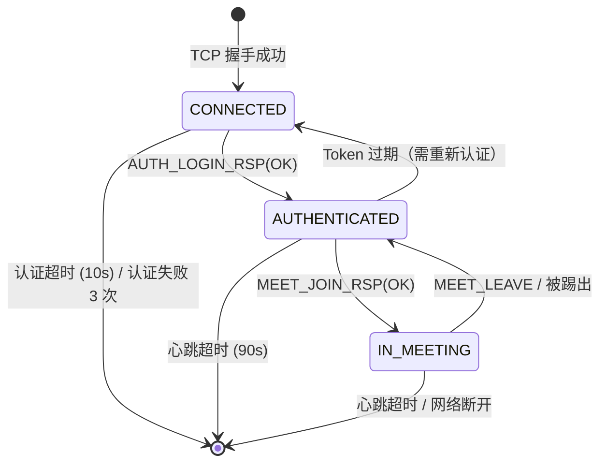
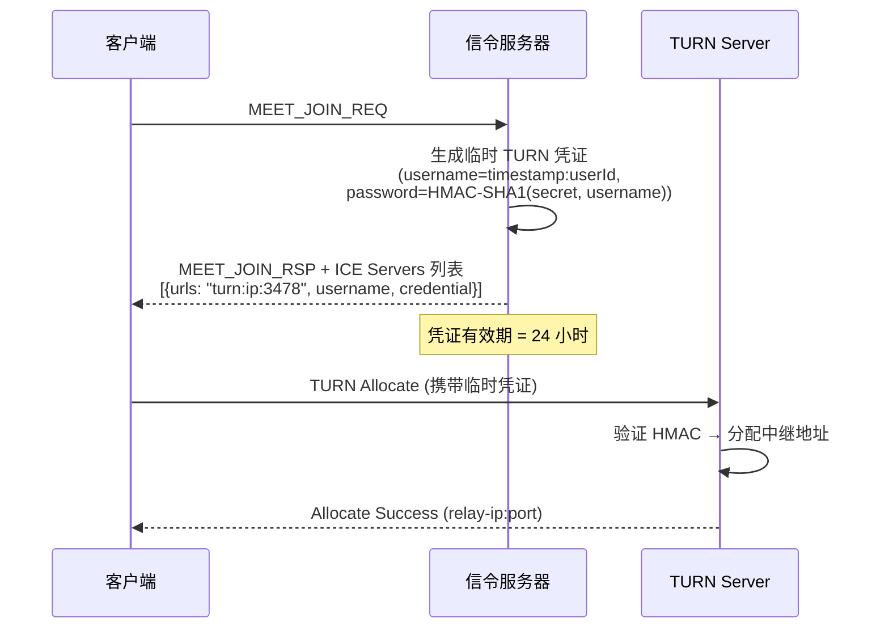
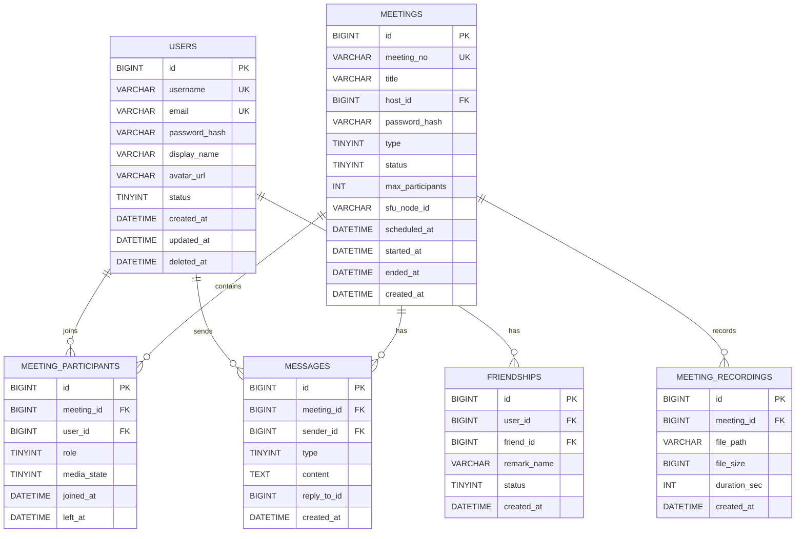
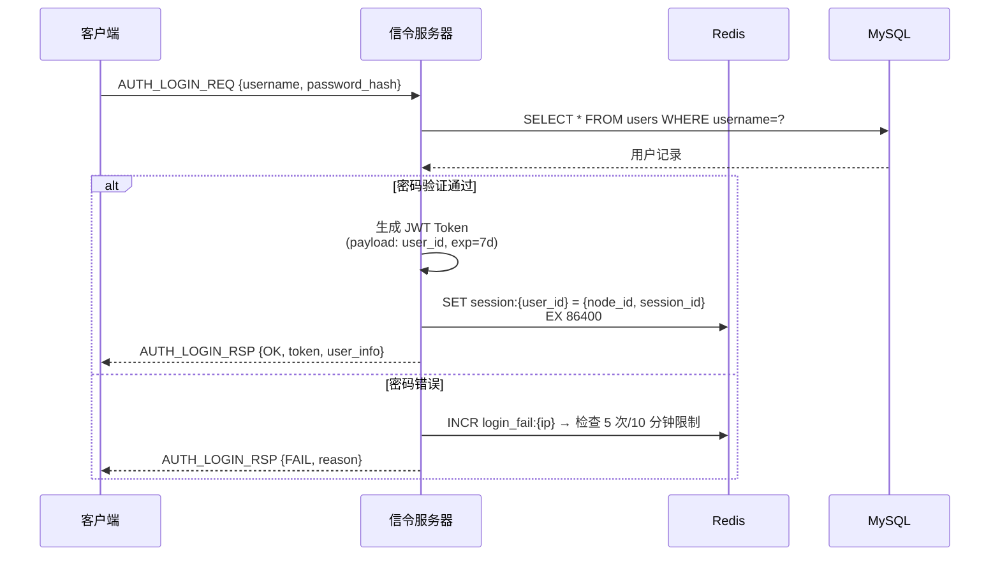
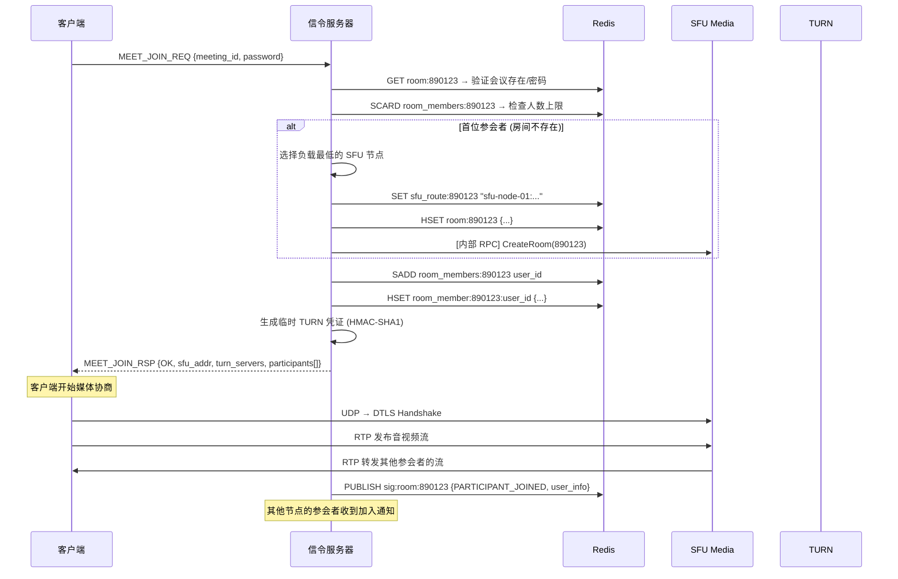

# 跨平台视频会议系统 — 服务端需求设计文档

> **定位**：与客户端设计文档配套的服务端架构方案
> **技术栈**：Go 1.22+（信令服务器）· C++17（SFU 媒体服务器）· Protobuf · MySQL 8 · Redis · coturn · Docker
> **语言分工**：信令 = Go（I/O 密集、高并发连接）· SFU = C++（CPU/带宽密集、零拷贝包转发）
> **设计目标**：支撑 1000 并发会议、单会议 16 人、总在线 5000 用户

---

## 1. 服务端总体架构

### 1.1 微服务拓扑

```
                        ┌──────────┐
                        │  Nginx   │  ← TLS 终结 / 负载均衡
                        │  (LB)    │
                        └────┬─────┘
                 ┌───────────┼───────────┐
                 ▼           ▼           ▼
          ┌────────────┐ ┌────────────┐ ┌────────────┐
          │ Signaling  │ │ Signaling  │ │ Signaling  │  ← 无状态，水平扩展
          │ Server #1  │ │ Server #2  │ │ Server #N  │
          └─────┬──────┘ └─────┬──────┘ └─────┬──────┘
                │              │              │
        ┌───────┴──────────────┴──────────────┴───────┐
        │                  Redis Cluster               │  ← 会话/房间状态
        │          (Pub/Sub + Session Store)            │
        └───────┬──────────────┬──────────────┬───────┘
                │              │              │
          ┌─────▼─────┐ ┌─────▼─────┐ ┌──────▼──────┐
          │   SFU      │ │   SFU     │ │  TURN/STUN  │
          │ Media #1   │ │ Media #2  │ │   Server    │
          └───────────┘ └───────────┘ └─────────────┘
                │              │
        ┌───────┴──────────────┴───────┐
        │         MySQL 8 (主从)        │  ← 持久化存储
        └──────────────────────────────┘
```

### 1.2 服务职责划分

| 服务 | 职责 | 协议 | 特性 |
|------|------|------|------|
| **Nginx (LB)** | TLS 终结、TCP 长连接负载均衡 | TCP/TLS | 基于连接哈希分配 |
| **Signaling Server (Go)** | 信令处理、会议管理、用户认证、消息路由 | TCP | 无状态、水平扩展、goroutine 并发 |
| **SFU Media Server** | 媒体流转发（非转码）、带宽估计、分层编码选择 | UDP (RTP/RTCP) | 有状态、按房间亲和 |
|  **TURN/STUN Server** | NAT 穿透、中继转发 | UDP/TCP | coturn 开源方案 |
| **Redis Cluster** | 会话存储、房间状态、跨节点 Pub/Sub | — | 内存级低延迟 |
| **MySQL 8** | 用户数据、会议记录、聊天消息持久化 | — | 主从复制、读写分离 |

### 1.3 核心设计原则

| 原则 | 落地方式 |
|------|---------|
| **信令无状态** | 所有会话状态存入 Redis，任意 Signaling 节点可处理任意用户请求 |
| **媒体按房间亲和** | 同一会议的所有媒体流路由到同一个 SFU 节点（Redis 记录映射） |
| **故障隔离** | 信令崩溃不影响正在进行的媒体流；SFU 崩溃通过信令通知客户端快速重连 |
| **零转码** | SFU 只做选择性转发（Selective Forwarding），不做转码，极大降低 CPU 成本 |

---

## 2. 信令服务器设计 (Go)

> **语言选择依据**：信令服务器是典型的 I/O 密集型服务（大量 TCP 长连接 + Redis/MySQL 读写），不涉及 CPU 密集计算。Go 的 goroutine 模型天然适配此场景：每连接一个 goroutine，代码直观、并发安全、开发效率高。

### 2.1 架构概览

```
┌───────────────────────────────────────────────────────┐
│              Signaling Server (Go)                     │
│                                                        │
│  ┌──────────────┐  ┌──────────────┐  ┌──────────────┐ │
│  │ TCP Listener │  │ Session Mgr  │  │  Auth Module │ │
│  │ (net.Listen) │  │ (sync.Map)   │  │  (JWT 鉴权)  │ │
│  └──────┬───────┘  └──────┬───────┘  └──────┬───────┘ │
│         │                 │                 │          │
│  ┌──────▼─────────────────▼─────────────────▼───────┐ │
│  │         Message Router (消息路由/Handler 注册)     │ │
│  └──┬────────┬────────┬────────┬────────┬───────────┘ │
│     ▼        ▼        ▼        ▼        ▼             │
│  ┌──────┐┌──────┐┌──────┐┌──────┐┌──────────────┐    │
│  │ Auth ││ Meet ││ Chat ││ File ││ Media Nego.  │    │
│  │Handle││Handle││Handle││Handle││ Handler      │    │
│  └──────┘└──────┘└──────┘└──────┘└──────────────┘    │
│     │        │        │        │        │             │
│  ┌──▼────────▼────────▼────────▼────────▼───────────┐ │
│  │                 Store Layer                       │ │
│  │       (go-redis/v9 + GORM/MySQL + Cache)          │ │
│  └──────────────────────────────────────────────────┘ │
└───────────────────────────────────────────────────────┘
```

### 2.2 Go 核心技术选型

| 领域 | Go 库 | 说明 |
|------|-------|------|
| TCP 网络 | `net` 标准库 | 每连接一个 goroutine（读）+ channel 写队列 |
| Protobuf | `google.golang.org/protobuf` | 与客户端共享 `.proto` 文件 |
| Redis | `github.com/redis/go-redis/v9` | 连接池 + Pub/Sub 订阅 |
| MySQL ORM | `gorm.io/gorm` + `gorm.io/driver/mysql` | 自动迁移 + 链式查询 |
| JWT | `github.com/golang-jwt/jwt/v5` | HS256 签名/验证 |
| 日志 | `go.uber.org/zap` | 结构化高性能日志 |
| 配置 | `github.com/spf13/viper` | YAML/ENV 配置加载 |
| ID 生成 | `github.com/bwmarrin/snowflake` | 雪花算法分布式 ID |
| 密码哈希 | `golang.org/x/crypto/argon2` | Argon2id 密码哈希 |

### 2.3 连接管理与会话模型

```go
package server

import (
    "net"
    "sync"
    "sync/atomic"
    "time"
)

// SessionState 会话状态机
type SessionState int32

const (
    StateConnected     SessionState = iota // TCP 已连接,未认证
    StateAuthenticated                      // 已认证,未入会
    StateInMeeting                          // 已入会
    StateDisconnected                       // 已断开
)

// Session 每个 TCP 连接对应一个 Session
type Session struct {
    ID        uint64           // 雪花算法生成的全局唯一 ID
    UserID    string           // 认证后绑定
    MeetingID string           // 入会后绑定
    State     atomic.Int32     // 线程安全的状态字段

    conn      net.Conn
    writeCh   chan []byte      // 写队列 (缓冲 channel,背压控制)
    closeCh   chan struct{}    // 关闭信号
    closeOnce sync.Once
}

func NewSession(conn net.Conn, id uint64) *Session {
    return &Session{
        ID:      id,
        conn:    conn,
        writeCh: make(chan []byte, 256), // 256 条消息缓冲
        closeCh: make(chan struct{}),
    }
}

// Serve 启动读写两个 goroutine
func (s *Session) Serve(handler MessageHandler) {
    go s.readLoop(handler)   // 读 goroutine: 解帧 → 路由
    go s.writeLoop()         // 写 goroutine: channel → TCP 发送
    go s.heartbeatLoop()     // 心跳检测 goroutine
}

func (s *Session) readLoop(handler MessageHandler) {
    defer s.Close()
    for {
        // 每次读操作设置 90s 超时（心跳保护）
        s.conn.SetReadDeadline(time.Now().Add(90 * time.Second))

        // 读取帧头: Magic(2) + Version(1) + Type(2) + Length(4) = 9 bytes
        header := make([]byte, 9)
        if _, err := io.ReadFull(s.conn, header); err != nil {
            return // 连接断开或超时
        }

        // 校验 Magic
        if header[0] != 0xAB || header[1] != 0xCD {
            return // 非法连接
        }

        msgType := binary.BigEndian.Uint16(header[2:4])
        payloadLen := binary.BigEndian.Uint32(header[5:9])

        // 防止恶意大包攻击 (最大 1MB)
        if payloadLen > 1<<20 {
            return
        }

        payload := make([]byte, payloadLen)
        if _, err := io.ReadFull(s.conn, payload); err != nil {
            return
        }

        // 路由到对应 Handler
        handler.Handle(s, SignalType(msgType), payload)
    }
}

func (s *Session) writeLoop() {
    defer s.Close()
    for {
        select {
        case data := <-s.writeCh:
            s.conn.SetWriteDeadline(time.Now().Add(10 * time.Second))
            if _, err := s.conn.Write(data); err != nil {
                return
            }
        case <-s.closeCh:
            return
        }
    }
}

func (s *Session) heartbeatLoop() {
    ticker := time.NewTicker(30 * time.Second)
    defer ticker.Stop()
    for {
        select {
        case <-ticker.C:
            // 发送心跳包，如果写入失败则关闭
            if err := s.Send(buildHeartbeat()); err != nil {
                s.Close()
                return
            }
        case <-s.closeCh:
            return
        }
    }
}

// Send 线程安全地发送数据（通过 channel 投递到写 goroutine）
func (s *Session) Send(data []byte) error {
    select {
    case s.writeCh <- data:
        return nil
    case <-s.closeCh:
        return ErrSessionClosed
    default:
        // 写缓冲满 → 客户端消费太慢,踢掉
        s.Close()
        return ErrWriteBufferFull
    }
}

// Close 安全关闭（只执行一次）
func (s *Session) Close() {
    s.closeOnce.Do(func() {
        s.State.Store(int32(StateDisconnected))
        close(s.closeCh)
        s.conn.Close()
    })
}
```

```go
// SessionManager 全局会话管理器 (并发安全)
type SessionManager struct {
    sessions sync.Map // map[uint64]*Session  (sessionID → Session)
    byUser   sync.Map // map[string]*Session  (userID → Session, 单点登录)
}

// Add 注册新会话
func (m *SessionManager) Add(s *Session) {
    m.sessions.Store(s.ID, s)
}

// BindUser 认证后绑定用户（踢掉旧会话实现单点登录）
func (m *SessionManager) BindUser(s *Session, userID string) {
    // 踢掉同 userID 的旧会话
    if old, loaded := m.byUser.LoadAndDelete(userID); loaded {
        old.(*Session).Send(buildKickNotify("账号在其他设备登录"))
        old.(*Session).Close()
    }
    s.UserID = userID
    m.byUser.Store(userID, s)
}

// BroadcastToRoom 房间广播（查 Redis 获取成员列表）
func (m *SessionManager) BroadcastToRoom(meetingID string, data []byte, excludeID uint64) {
    // 从 Redis 获取 room_members:{meetingID}
    members := m.redis.SMembers(ctx, "room_members:"+meetingID).Val()
    for _, userID := range members {
        if sess, ok := m.byUser.Load(userID); ok {
            s := sess.(*Session)
            if s.ID != excludeID {
                s.Send(data) // 本节点直接发
            }
        }
        // 不在本节点的成员 → Redis Pub/Sub 转发（见 2.5 节）
    }
}
```

#### 连接生命周期



### 2.4 Handler 注册机制

```go
// MessageHandler 接口 — 每种信令类型注册一个 Handler
type Handler interface {
    Handle(session *Session, payload []byte) error
}

// Router 消息路由器
type Router struct {
    handlers map[SignalType]Handler
}

func NewRouter(deps *Dependencies) *Router {
    r := &Router{handlers: make(map[SignalType]Handler)}

    // 注册各模块 Handler
    auth := NewAuthHandler(deps)
    r.Register(AuthLoginReq,     auth)
    r.Register(AuthLogoutReq,    auth)
    r.Register(AuthHeartbeat,    auth)

    meet := NewMeetingHandler(deps)
    r.Register(MeetCreateReq,    meet)
    r.Register(MeetJoinReq,      meet)
    r.Register(MeetLeaveReq,     meet)
    r.Register(MeetKickReq,      meet)
    r.Register(MeetMuteReq,      meet)

    chat := NewChatHandler(deps)
    r.Register(ChatSendReq,      chat)

    media := NewMediaNegotiationHandler(deps)
    r.Register(MediaOffer,       media)
    r.Register(MediaAnswer,      media)
    r.Register(MediaIceCandidate, media)
    r.Register(MediaMuteToggle,  media)

    return r
}

func (r *Router) Handle(s *Session, msgType SignalType, payload []byte) {
    handler, ok := r.handlers[msgType]
    if !ok {
        log.Warn("unknown signal type", zap.Uint16("type", uint16(msgType)))
        return
    }

    // 状态检查中间件
    if err := checkSessionState(s, msgType); err != nil {
        s.Send(buildError(msgType, err))
        return
    }

    if err := handler.Handle(s, payload); err != nil {
        log.Error("handler error", zap.Error(err))
    }
}
```

### 2.5 跨节点通信 (Redis Pub/Sub)

```
Channel 命名规范:
  sig:node:{node_id}     — 节点私有频道（接收定向转发）
  sig:room:{meeting_id}  — 房间频道（接收房间广播）

消息格式 (JSON):
{
  "type": "ROOM_BROADCAST",
  "source_session": 123456,
  "meeting_id": "890123",
  "signal_type": 1027,
  "payload_b64": "base64_encoded_protobuf..."
}
```

```go
// Pub/Sub 订阅 goroutine（每个节点启动时运行）
func (s *SignalingServer) subscribePubSub(ctx context.Context) {
    // 订阅本节点频道
    nodeSub := s.redis.Subscribe(ctx, "sig:node:"+s.nodeID)
    defer nodeSub.Close()

    for msg := range nodeSub.Channel() {
        var relay RelayMessage
        json.Unmarshal([]byte(msg.Payload), &relay)

        // 在本节点查找目标 Session 并转发
        if sess, ok := s.sessions.byUser.Load(relay.TargetUserID); ok {
            sess.(*Session).Send(relay.RawPayload)
        }
    }
}
```

### 2.6 消息路由规则

```
收到客户端消息后:
  │
  ├── 解析帧头 → 校验 Magic + Version
  ├── 反序列化 Protobuf Payload
  ├── 检查 Session 状态 (是否已认证 / 是否在会议中)
  │
  ├── 单播 (Unicast):
  │   AUTH_*, MEET_CREATE_*, MEET_JOIN_* → 直接处理，响应发送者
  │
  ├── 房间广播 (Room Broadcast):
  │   CHAT_SEND, MEDIA_MUTE_TOGGLE, MEET_STATE_SYNC
  │   → 查 Redis 获取同房间所有 session_id
  │   → 本节点的直接发送
  │   → 其他节点的通过 Redis Pub/Sub 转发
  │
  └── 定向转发 (Relay):
      MEDIA_OFFER/ANSWER/ICE_CANDIDATE
      → 根据 target_user_id 查 Redis 定位目标节点
      → 转发到目标 Session
```

---

## 3. SFU 媒体服务器设计

### 3.1 SFU 核心概念

> **SFU (Selective Forwarding Unit)**：不做转码，只做选择性转发。每个发布者的流被按需转发给订阅者，相比 MCU 极大降低服务端 CPU 消耗。

```
           ┌─────────────────────────────────┐
           │         SFU Media Server         │
           │                                  │
  User A ─→│  Publisher A ──┐                 │
           │                ├──→ Subscriber B │→─ User B
  User B ─→│  Publisher B ──┤                 │
           │                ├──→ Subscriber A │→─ User A
  User C ─→│  Publisher C ──┤                 │
           │                ├──→ Subscriber A │→─ User A
           │                └──→ Subscriber B │→─ User B
           │                                  │
           └─────────────────────────────────┘

 关键点：
 - 3 人会议 → 3 个 Publisher + 6 个 Subscriber
 - N 人会议 → N 个 Publisher + N×(N-1) 个 Subscriber
 - 服务端带宽 = Σ(每个发布者的码率 × 订阅者数量)
```

### 3.2 SFU 内部架构

```
┌──────────────────────────────────────────────────────┐
│                   SFU Media Server                    │
│                                                       │
│  ┌─────────────┐    ┌───────────────────────────┐    │
│  │ UDP Listener │    │     Room Manager          │    │
│  │ (port 10000- │    │                           │    │
│  │  20000)      │    │  Room "890123"            │    │
│  └──────┬───────┘    │  ├── Publisher A (SSRC=X) │    │
│         │            │  │   ├── Audio Track      │    │
│         │            │  │   └── Video Track      │    │
│         ▼            │  ├── Publisher B (SSRC=Y) │    │
│  ┌──────────────┐    │  │   ├── Audio Track      │    │
│  │ RTP Router   │◄──►│  │   └── Video Track      │    │
│  │ (SSRC 路由)   │    │  └── Subscriptions:      │    │
│  └──────┬───────┘    │      A→{B,C}, B→{A,C}    │    │
│         │            └───────────────────────────┘    │
│         ▼                                             │
│  ┌──────────────┐    ┌───────────────────────────┐   │
│  │ RTCP Handler │    │ Bandwidth Estimator (BWE) │   │
│  │ (SR/RR/NACK/ │◄──►│                           │   │
│  │  PLI/REMB)   │    │ 每个订阅者独立估算带宽     │   │
│  └──────────────┘    └───────────────────────────┘   │
│                                                       │
│  ┌──────────────────────────────────────────────┐    │
│  │         NACK / PLI 重传缓冲区                  │    │
│  │  环形缓冲最近 500 个 RTP 包（约 16 秒@30fps）  │    │
│  └──────────────────────────────────────────────┘    │
└──────────────────────────────────────────────────────┘
```

### 3.3 RTP 路由流程

```
收到 RTP 包:
  │
  ├── 1. 解析 RTP Header → 提取 SSRC
  ├── 2. SSRC → Room + Publisher 查找
  ├── 3. 存入 NACK 重传缓冲区
  ├── 4. 获取该 Publisher 的所有 Subscriber 列表
  ├── 5. 对每个 Subscriber:
  │       ├── 检查该 Subscriber 的带宽预算
  │       ├── 如果是 Simulcast → 选择合适的层 (High/Mid/Low)
  │       ├── 重写 SSRC 为 Subscriber 期望的 SSRC
  │       └── UDP sendto() 转发
  └── 6. 更新统计（吞吐量、丢包率）
```

### 3.4 RTCP 处理策略

| RTCP 类型 | 方向 | 处理方式 |
|-----------|------|---------|
| **SR (Sender Report)** | Publisher → SFU | 记录发送统计，用于同步和 RTT 计算 |
| **RR (Receiver Report)** | Subscriber → SFU | 提取丢包率/抖动，输入 BWE 算法 |
| **NACK** | Subscriber → SFU | 在重传缓冲区查找丢失包，重传给请求者 |
| **PLI (Picture Loss)** | Subscriber → SFU → Publisher | 透传给发布者，请求发送关键帧 |
| **REMB** | SFU → Publisher | 汇总所有订阅者带宽，反馈给发布者调整码率 |

### 3.5 Simulcast 分层转发

```
发布者发送 3 层视频流:
  ┌──────────────────────────┐
  │ High:  1280×720  @30fps  │ ← 2000 kbps
  │ Mid:   640×360   @25fps  │ ←  500 kbps
  │ Low:   320×180   @15fps  │ ←  150 kbps
  └──────────────────────────┘

SFU 为每个订阅者独立选层:
  ├── 全屏观看的订阅者     → 转发 High 层
  ├── 宫格中的订阅者       → 转发 Mid 层
  ├── 缩略图/带宽不足      → 转发 Low 层
  └── 订阅者切换观看模式时 → 动态切层（PLI 请求关键帧后切换）
```

---

## 4. STUN/TURN 服务器设计

### 4.1 部署方案

采用开源 **coturn** 服务器，无需自研：

```bash
# coturn 核心配置 (/etc/turnserver.conf)
listening-port=3478            # STUN/TURN 标准端口
tls-listening-port=5349        # TURN over TLS
relay-ip=<公网IP>
external-ip=<公网IP>
min-port=49152                 # 媒体中继端口范围
max-port=65535
realm=meeting.example.com
user=turnuser:turnpassword     # 静态凭证（生产环境用临时凭证）
lt-cred-mech                   # 长期凭证机制
fingerprint
no-multicast-peers
```

### 4.2 临时凭证分发流程



---

## 5. 服务端数据库设计 (MySQL 8)

### 5.1 设计原则

| 原则 | 说明 |
|------|------|
| **主从分离** | 写操作 → 主库，读操作 → 从库 |
| **UTF-8mb4** | 全表使用 `utf8mb4` 字符集，支持 Emoji |
| **索引优化** | 联合索引遵循最左前缀，覆盖高频查询 |
| **软删除** | 用户和会议数据设 `deleted_at` 字段，不物理删除 |
| **分表预案** | `message` 表按 `meeting_id` 哈希分表（日消息量 > 100 万时启用） |

### 5.2 ER 关系图



### 5.3 建表 SQL

```sql
-- ==================== 用户表 ====================
CREATE TABLE users (
    id            BIGINT UNSIGNED AUTO_INCREMENT PRIMARY KEY,
    username      VARCHAR(64)  NOT NULL,
    email         VARCHAR(128) NOT NULL,
    password_hash VARCHAR(255) NOT NULL,           -- Argon2id 哈希
    display_name  VARCHAR(64)  NOT NULL DEFAULT '',
    avatar_url    VARCHAR(512) DEFAULT '',
    status        TINYINT      NOT NULL DEFAULT 0, -- 0=离线 1=在线 2=忙碌
    created_at    DATETIME     NOT NULL DEFAULT CURRENT_TIMESTAMP,
    updated_at    DATETIME     NOT NULL DEFAULT CURRENT_TIMESTAMP ON UPDATE CURRENT_TIMESTAMP,
    deleted_at    DATETIME     DEFAULT NULL,       -- 软删除
    UNIQUE KEY uk_username (username),
    UNIQUE KEY uk_email (email),
    INDEX idx_status (status)
) ENGINE=InnoDB DEFAULT CHARSET=utf8mb4 COLLATE=utf8mb4_unicode_ci;

-- ==================== 会议表 ====================
CREATE TABLE meetings (
    id               BIGINT UNSIGNED AUTO_INCREMENT PRIMARY KEY,
    meeting_no       VARCHAR(12)  NOT NULL,         -- 6-8 位数字会议号
    title            VARCHAR(128) NOT NULL DEFAULT '未命名会议',
    host_id          BIGINT UNSIGNED NOT NULL,
    password_hash    VARCHAR(255) DEFAULT '',
    type             TINYINT      NOT NULL DEFAULT 0,  -- 0=即时 1=预约
    status           TINYINT      NOT NULL DEFAULT 0,  -- 0=等待 1=进行中 2=已结束
    max_participants INT          NOT NULL DEFAULT 16,
    sfu_node_id      VARCHAR(64)  DEFAULT '',          -- 分配的 SFU 节点 ID
    scheduled_at     DATETIME     DEFAULT NULL,
    started_at       DATETIME     DEFAULT NULL,
    ended_at         DATETIME     DEFAULT NULL,
    created_at       DATETIME     NOT NULL DEFAULT CURRENT_TIMESTAMP,
    UNIQUE KEY uk_meeting_no (meeting_no),
    INDEX idx_host (host_id),
    INDEX idx_status_created (status, created_at DESC),
    FOREIGN KEY (host_id) REFERENCES users(id)
) ENGINE=InnoDB DEFAULT CHARSET=utf8mb4 COLLATE=utf8mb4_unicode_ci;

-- ==================== 参会者表 ====================
CREATE TABLE meeting_participants (
    id          BIGINT UNSIGNED AUTO_INCREMENT PRIMARY KEY,
    meeting_id  BIGINT UNSIGNED NOT NULL,
    user_id     BIGINT UNSIGNED NOT NULL,
    role        TINYINT NOT NULL DEFAULT 0,    -- 0=参与者 1=主持人 2=联合主持
    media_state TINYINT NOT NULL DEFAULT 0,    -- Bitmap: bit0=音频 bit1=视频 bit2=屏幕共享
    joined_at   DATETIME NOT NULL DEFAULT CURRENT_TIMESTAMP,
    left_at     DATETIME DEFAULT NULL,
    UNIQUE KEY uk_meeting_user (meeting_id, user_id),
    INDEX idx_user (user_id),
    FOREIGN KEY (meeting_id) REFERENCES meetings(id),
    FOREIGN KEY (user_id)    REFERENCES users(id)
) ENGINE=InnoDB DEFAULT CHARSET=utf8mb4 COLLATE=utf8mb4_unicode_ci;

-- ==================== 消息表 ====================
CREATE TABLE messages (
    id          BIGINT UNSIGNED AUTO_INCREMENT PRIMARY KEY,
    meeting_id  BIGINT UNSIGNED NOT NULL,
    sender_id   BIGINT UNSIGNED NOT NULL,
    type        TINYINT NOT NULL DEFAULT 0,    -- 0=文字 1=图片 2=文件 3=系统
    content     TEXT NOT NULL,
    reply_to_id BIGINT UNSIGNED DEFAULT NULL,
    created_at  DATETIME NOT NULL DEFAULT CURRENT_TIMESTAMP,
    INDEX idx_meeting_time (meeting_id, created_at DESC),
    INDEX idx_sender (sender_id),
    FOREIGN KEY (meeting_id) REFERENCES meetings(id),
    FOREIGN KEY (sender_id)  REFERENCES users(id)
) ENGINE=InnoDB DEFAULT CHARSET=utf8mb4 COLLATE=utf8mb4_unicode_ci;

-- ==================== 好友关系表 ====================
CREATE TABLE friendships (
    id          BIGINT UNSIGNED AUTO_INCREMENT PRIMARY KEY,
    user_id     BIGINT UNSIGNED NOT NULL,
    friend_id   BIGINT UNSIGNED NOT NULL,
    remark_name VARCHAR(64) DEFAULT '',
    status      TINYINT NOT NULL DEFAULT 0,    -- 0=待确认 1=已通过 2=已拒绝 3=已拉黑
    created_at  DATETIME NOT NULL DEFAULT CURRENT_TIMESTAMP,
    UNIQUE KEY uk_pair (user_id, friend_id),
    INDEX idx_friend (friend_id),
    FOREIGN KEY (user_id)   REFERENCES users(id),
    FOREIGN KEY (friend_id) REFERENCES users(id)
) ENGINE=InnoDB DEFAULT CHARSET=utf8mb4 COLLATE=utf8mb4_unicode_ci;

-- ==================== 会议录制表 ====================
CREATE TABLE meeting_recordings (
    id           BIGINT UNSIGNED AUTO_INCREMENT PRIMARY KEY,
    meeting_id   BIGINT UNSIGNED NOT NULL,
    file_path    VARCHAR(512) NOT NULL,
    file_size    BIGINT UNSIGNED NOT NULL DEFAULT 0,
    duration_sec INT UNSIGNED NOT NULL DEFAULT 0,
    created_at   DATETIME NOT NULL DEFAULT CURRENT_TIMESTAMP,
    INDEX idx_meeting (meeting_id),
    FOREIGN KEY (meeting_id) REFERENCES meetings(id)
) ENGINE=InnoDB DEFAULT CHARSET=utf8mb4 COLLATE=utf8mb4_unicode_ci;
```

---

## 6. 认证与安全设计

### 6.1 认证流程



### 6.2 JWT Token 结构

```json
{
  "header": { "alg": "HS256", "typ": "JWT" },
  "payload": {
    "sub": "user_id_12345",
    "iss": "meeting-server",
    "iat": 1711584000,
    "exp": 1712188800,
    "roles": ["user"]
  }
}
```

### 6.3 安全防线一览

| 层级 | 措施 |
|------|------|
| **传输层** | 信令 TCP 通道强制 TLS 1.3（Nginx 终结）；媒体通道 DTLS-SRTP |
| **认证层** | JWT Token + Redis 会话绑定；同一账号仅允许单点登录（新登录踢旧会话） |
| **防暴力破解** | 同 IP 10 分钟内登录失败 ≥ 5 次 → 锁定 30 分钟 |
| **会议安全** | 会议密码 Argon2id 哈希存储；等候室机制（主持人手动批准入会） |
| **数据安全** | 密码 Argon2id 哈希；聊天内容服务端不解密（可选 E2EE） |
| **防 DDoS** | Nginx `limit_conn` + `limit_req`；UDP 端口仅允许已注册 SSRC 的包 |

---

## 7. Redis 数据结构设计

```
# ==================== 在线用户会话 ====================
# Key:   session:{user_id}
# Type:  Hash
# TTL:   24h (心跳续期)
HSET session:user_12345
     node_id       "sig-node-01"
     session_id    "98765"
     meeting_id    "890123"      # 空=不在会议中
     status        "1"           # 在线状态
     connected_at  "1711584000"

# ==================== 会议房间状态 ====================
# Key:   room:{meeting_id}
# Type:  Hash
HSET room:890123
     host_id        "user_12345"
     sfu_node_id    "sfu-node-01"
     status         "1"            # 进行中
     created_at     "1711584000"

# ==================== 房间成员列表 ====================
# Key:   room_members:{meeting_id}
# Type:  Set
SADD room_members:890123 "user_12345" "user_67890" "user_11111"

# ==================== 房间成员详情 ====================
# Key:   room_member:{meeting_id}:{user_id}
# Type:  Hash
HSET room_member:890123:user_12345
     display_name   "张三"
     role           "1"           # 主持人
     is_audio_on    "1"
     is_video_on    "1"
     is_sharing     "0"

# ==================== 会议号 → SFU 映射 ====================
# Key:   sfu_route:{meeting_id}
# Type:  String
SET sfu_route:890123 "sfu-node-01:10.0.1.5:10000"

# ==================== 防暴力破解计数器 ====================
# Key:   login_fail:{ip}
# Type:  String (counter)
# TTL:   600s (10 分钟窗口)
INCR login_fail:192.168.1.100
```

---

## 8. 信令-媒体协作流程

### 8.1 完整入会流程



### 8.2 离会与房间清理

```
用户离会 (主动/心跳超时/网络断开):
  │
  ├── 1. 信令服务器:
  │       SREM room_members:{meeting_id} user_id
  │       DEL  room_member:{meeting_id}:{user_id}
  │       PUBLISH sig:room:{meeting_id} {PARTICIPANT_LEFT}
  │       INSERT meeting_participants SET left_at=NOW()  (MySQL)
  │
  ├── 2. 检查房间是否为空:
  │       SCARD room_members:{meeting_id}
  │       if count == 0:
  │           → [内部 RPC] SFU.DestroyRoom(meeting_id)
  │           → DEL room:{meeting_id}
  │           → DEL sfu_route:{meeting_id}
  │           → UPDATE meetings SET status=2, ended_at=NOW()  (MySQL)
  │
  └── 3. 主持人离会:
          → 自动转移主持人给最早加入的参会者
          → PUBLISH 主持人变更通知
```

---

## 9. 部署架构

### 9.1 Docker Compose (开发/测试环境)

```yaml
version: '3.8'

services:
  # ---- 信令服务器 (Go) ----
  signaling:
    build:
      context: ./signaling
      dockerfile: Dockerfile   # 多阶段构建: golang:1.22 → scratch
    ports:
      - "8443:8443"            # TCP 信令端口
    environment:
      - REDIS_URL=redis://redis:6379
      - MYSQL_DSN=root:pass@tcp(mysql:3306)/meeting?charset=utf8mb4&parseTime=True
      - JWT_SECRET=your-secret-key
      - NODE_ID=sig-node-01
    depends_on:
      - redis
      - mysql
    deploy:
      replicas: 2              # 无状态,可水平扩展

  # ---- SFU 媒体服务器 (C++) ----
  sfu:
    build:
      context: ./sfu
      dockerfile: Dockerfile   # 基于 ubuntu:24.04 + FFmpeg + Boost
    ports:
      - "10000-10100:10000-10100/udp"  # RTP 端口池
    environment:
      - REDIS_URL=redis://redis:6379
      - PUBLIC_IP=${PUBLIC_IP}
    network_mode: host      # UDP 性能需要 host 网络

  # ---- TURN 服务器 ----
  turn:
    image: coturn/coturn:latest
    ports:
      - "3478:3478/udp"
      - "3478:3478/tcp"
      - "5349:5349/tcp"     # TLS
      - "49152-65535:49152-65535/udp"  # 中继端口
    volumes:
      - ./turnserver.conf:/etc/turnserver.conf
    network_mode: host

  # ---- Redis ----
  redis:
    image: redis:7-alpine
    ports:
      - "6379:6379"
    volumes:
      - redis_data:/data
    command: redis-server --appendonly yes --maxmemory 256mb

  # ---- MySQL 8 ----
  mysql:
    image: mysql:8.0
    ports:
      - "3306:3306"
    environment:
      MYSQL_ROOT_PASSWORD: pass
      MYSQL_DATABASE: meeting
      MYSQL_CHARACTER_SET_SERVER: utf8mb4
      MYSQL_COLLATION_SERVER: utf8mb4_unicode_ci
    volumes:
      - mysql_data:/var/lib/mysql
      - ./sql/init.sql:/docker-entrypoint-initdb.d/init.sql

  # ---- Nginx 负载均衡 ----
  nginx:
    image: nginx:alpine
    ports:
      - "443:443"
    volumes:
      - ./nginx.conf:/etc/nginx/nginx.conf
      - ./certs:/etc/nginx/certs
    depends_on:
      - signaling

volumes:
  redis_data:
  mysql_data:
```

### 9.2 生产环境部署拓扑

```
                    ┌─────────────┐
                    │   DNS 解析   │
                    └──────┬──────┘
                           │
                    ┌──────▼──────┐
                    │  CDN / WAF  │
                    └──────┬──────┘
                           │
              ┌────────────┼────────────┐
              │            │            │
        ┌─────▼────┐ ┌────▼─────┐ ┌────▼─────┐
        │ Nginx #1 │ │ Nginx #2 │ │ Nginx #3 │  ← HA (Keepalived)
        └─────┬────┘ └────┬─────┘ └────┬─────┘
              │            │            │
        ┌─────▼────────────▼────────────▼─────┐
        │        Signaling Server × 3          │  ← K8s Deployment
        └─────────────────┬───────────────────┘
                          │
                   ┌──────▼──────┐
                   │ Redis Cluster│  ← 3 主 3 从
                   │  (6 节点)    │
                   └──────┬──────┘
                          │
        ┌─────────────────┼─────────────────┐
        │                 │                 │
  ┌─────▼─────┐    ┌─────▼─────┐    ┌──────▼──────┐
  │  SFU #1   │    │  SFU #2   │    │  coturn × 2 │
  │ (高配机器) │    │ (高配机器) │    │  (高带宽)    │
  └───────────┘    └───────────┘    └─────────────┘
        │                 │
  ┌─────▼─────────────────▼─────┐
  │     MySQL 8 (主从复制)       │
  │   Master + 2 Read Replicas  │
  └─────────────────────────────┘

硬件建议:
  Signaling(Go): 2C4G × 3 (I/O 密集型,Go 内存占用极低)
  SFU(C++):      8C16G × 2 (带宽密集型：100Mbps+ 网卡)
  Redis:         4C8G × 6  (内存型)
  MySQL:         8C32G × 3 (存储型：SSD)
  coturn:        4C8G × 2  (带宽密集型)
```

---

## 10. 服务端目录结构

```
meeting-server/
├── docker-compose.yml
├── nginx.conf
├── turnserver.conf
│
├── proto/                         ← 共享 Protobuf 定义
│   ├── signaling.proto            # 信令消息定义（Go + C++ + 客户端共用）
│   └── generate.sh               # 一键生成 Go/C++ 代码
│
├── signaling/                     ← 信令服务器 (Go)
│   ├── go.mod
│   ├── go.sum
│   ├── Dockerfile                 # 多阶段构建: golang:1.22-alpine → scratch
│   ├── main.go                    # 入口: 加载配置 → 启动 TCP 监听
│   ├── config/
│   │   ├── config.go              # Viper 配置加载
│   │   └── config.yaml            # 默认配置文件
│   ├── server/
│   │   ├── tcp_server.go          # TCP Listener + Accept Loop
│   │   ├── session.go             # Session 结构体 + 读写 goroutine
│   │   └── session_manager.go     # sync.Map 会话管理 + 单点登录
│   ├── protocol/
│   │   ├── frame.go               # 二进制帧 编码/解码 (Magic+Version+Type+Length)
│   │   ├── signal_type.go         # SignalType 枚举常量
│   │   └── pb/                    # protoc 生成的 Go 代码
│   │       └── signaling.pb.go
│   ├── handler/
│   │   ├── handler.go             # Handler 接口定义
│   │   ├── router.go              # 消息路由器 (SignalType → Handler 映射)
│   │   ├── auth_handler.go        # 登录/登出/心跳
│   │   ├── meeting_handler.go     # 创建/加入/离开/踢人/静音
│   │   ├── chat_handler.go        # 聊天消息收发
│   │   ├── file_handler.go        # 文件传输信令
│   │   └── media_handler.go       # Offer/Answer/ICE 中转
│   ├── store/
│   │   ├── redis.go               # go-redis 连接池 + Pub/Sub
│   │   ├── mysql.go               # GORM 初始化 + 连接池
│   │   ├── user_repo.go           # 用户 CRUD
│   │   ├── meeting_repo.go        # 会议 CRUD
│   │   └── message_repo.go        # 消息 CRUD
│   ├── auth/
│   │   ├── jwt.go                 # JWT 生成/验证
│   │   └── rate_limiter.go        # Redis 滑动窗口限流
│   ├── model/
│   │   ├── user.go                # GORM 模型 (对应 MySQL users 表)
│   │   ├── meeting.go
│   │   ├── participant.go
│   │   ├── message.go
│   │   └── friendship.go
│   └── pkg/
│       ├── snowflake.go           # 雪花算法 ID 生成
│       └── logger.go              # Zap logger 封装
│
├── sfu/                           ← SFU 媒体服务器 (C++17)
│   ├── CMakeLists.txt
│   ├── Dockerfile
│   ├── main.cpp
│   ├── server/
│   │   ├── UdpServer.h/cpp        # UDP 收发 (Boost.Asio)
│   │   └── DtlsContext.h/cpp      # DTLS 握手
│   ├── room/
│   │   ├── RoomManager.h/cpp
│   │   ├── Room.h/cpp
│   │   ├── Publisher.h/cpp
│   │   └── Subscriber.h/cpp
│   ├── rtp/
│   │   ├── RtpParser.h/cpp
│   │   ├── RtpRouter.h/cpp        # SSRC 路由
│   │   ├── RtcpHandler.h/cpp
│   │   ├── NackBuffer.h/cpp       # 重传缓冲区
│   │   └── JitterBuffer.h/cpp
│   ├── bwe/
│   │   └── BandwidthEstimator.h/cpp
│   └── simulcast/
│       └── LayerSelector.h/cpp    # Simulcast 分层选择
│
├── sql/                           ← 数据库脚本
│   ├── init.sql                   # 建表 DDL
│   └── migrations/
│       ├── V001_init.sql
│       └── V002_add_recordings.sql
│
└── tests/
    ├── signaling/                 # Go 测试
    │   ├── auth_handler_test.go
    │   ├── meeting_handler_test.go
    │   └── session_test.go
    └── sfu/                       # C++ 测试
        ├── test_rtp_router.cpp
        └── test_nack_buffer.cpp
```

---

## 11. 监控与运维

### 11.1 关键监控指标

| 指标 | 报警阈值 | 采集方式 |
|------|---------|---------|
| **信令连接数** | > 3000/节点 | Prometheus Gauge |
| **信令消息 QPS** | > 5000/节点 | Prometheus Counter |
| **SFU 入口带宽** | > 80% 网卡容量 | Prometheus Gauge |
| **SFU 出口带宽** | > 80% 网卡容量 | Prometheus Gauge |
| **活跃会议数** | > 800 | Redis DBSIZE |
| **RTP 丢包率** | > 5% | RTCP RR 统计 |
| **信令 P99 延迟** | > 50ms | Histogram |
| **MySQL 慢查询** | > 100ms | Slow Query Log |
| **Redis 内存占用** | > 200MB | `INFO memory` |

### 11.2 日志规范

```
格式: [时间] [级别] [服务名] [TraceID] [模块] 消息
示例:
  [2026-03-28 01:20:15.123] [INFO]  [signaling-01] [abc123] [AuthHandler] 用户 user_12345 登录成功, IP=1.2.3.4
  [2026-03-28 01:20:16.456] [WARN]  [sfu-01]       [def456] [RtpRouter]   房间 890123 丢包率 8.5%, 触发 REMB 降级
  [2026-03-28 01:20:17.789] [ERROR] [signaling-02] [ghi789] [MeetingHandler] 会议 890123 不存在, 来源 user_67890
```

---

## 12. 客户端 ↔ 服务端对照表

| 客户端模块 (C++/Qt) | 对应服务端 | 语言 | 协议 | 说明 |
|---------------------|----------|------|------|------|
| `SignalingClient` | Signaling Server | **Go** | TCP/TLS | 信令交互 |
| `RTPSender/Receiver` | SFU `RtpRouter` | **C++** | UDP/DTLS | 媒体转发 |
| `StunClient` | coturn | — | UDP | NAT 穿透 |
| `TurnClient` | coturn | — | UDP/TCP | 中继转发 |
| `DatabaseManager (SQLite)` | GORM + go-redis | **Go** | — | 本地缓存 vs 服务端持久化 |
| `TokenManager` | `auth/jwt.go` | **Go** | — | Token 生成(Go) / 存储验证(客户端) |
| `BandwidthEstimator` | BWE + `LayerSelector` | **C++** | RTCP | 客户端上报 → SFU 决策 |

---

## 13. 开发顺序路线图

```
Phase 0 ─ 共享协议层 (1周)
   └── proto/signaling.proto 定义
   └── protoc 生成 Go + C++ 代码
   └── 客户端 frame 编解码实现
        ▼
Phase 1 ─ Go 信令服务器骨架 (2周)
   └── TCP 监听 · 帧解析 · Session/goroutine 模型
   └── GORM 自动建表 · go-redis 连接
   └── JWT 认证 · 心跳 · 断线清理
        ▼
Phase 2 ─ Qt 客户端骨架 (2周)
   └── QML 登录页 · SignalingClient(TCP)
   └── Token 管理 · 断线重连
        ▼
Phase 3 ─ 会议管理 垂直打通 (2周)
   └── Go: 创建/加入/离开会议 · 房间状态 (Redis)
   └── Qt: 会议 UI · 参会者列表
        ▼
Phase 4 ─ 音频管线 端到端 (3周)
   └── Qt: 采集 → Opus 编码 → RTP 发送 → P2P 直连
   └── Qt: RTP 接收 → Opus 解码 → 播放
        ▼
Phase 5 ─ 视频管线 端到端 (3周)
   └── Qt: 采集 → H.264 硬编 → RTP
   └── Qt: RTP → 硬解 → OpenGL NV12 渲染
        ▼
Phase 6 ─ C++ SFU 媒体服务器 (3周)
   └── RTP 路由 · NACK 重传 · RTCP · 多人转发
        ▼
Phase 7 ─ 增强功能 (按优先级)
   └── 屏幕共享 · 聊天 · NAT穿透 · 动态码率 · 降噪
```
